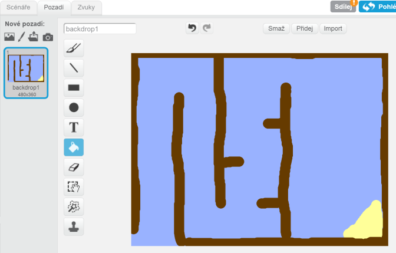
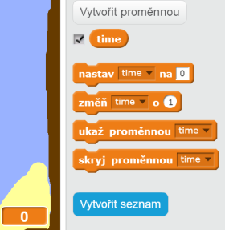

---
title: Závod lodí
level: Scratch 1
language: cs-CZ
stylesheet: scratch
embeds: "*.png"
materials: ["Club Leader Resources/*","Project Resources/*"]
...

# Úvod { .intro }

Naučíte se jak vytvořit hru, ve které budete používat myš k navigaci loďky na opuštěný ostrov.

<div class="scratch-preview">
  <iframe allowtransparency="true" width="485" height="402" src="http://scratch.mit.edu/projects/embed/63957956/?autostart=false" frameborder="0"></iframe>
  
</div>

# Step 1: Naplánování hry { .activity }

## Seznam úkolů { .check }

+ Vytovřte nový projekt a smažte kočičku, takže váš projekt bude prázdný. Online editor můžete nalézt zde: <a href="http://jumpto.cc/scratch-new">jumpto.cc/scratch-new</a>.

+ Naplánujte si váš level hry. Klikněte na "Stage backdrop". Měli byste přidat:
	+ Dřevo, kterému se bude loďka vyhýbat;
	+ Opuštěný ostrov, na kterém má loďka přistát.

	Tady je obrázek jak by měla vaše hra vypadat:

	 

# Step 2: Ovládání loďky { .activity }

## Activity Checklist { .check }

+ Pokud vám dal vedoucí klubu adresář se soubory, klikněte na  'Upload sprite from file' a vyberte obrázek 'boat.png'. Měli byste zmenšit obrázek a vložit ho na startovní pozici.

	

	Pokud obrázek nemáte, můžete si loďku nakreslit!

+ Abyste mohli ovládat loďku myší, přidejte tento kód:

	```blocks
		when flag clicked
		point in direction (0 v)
		go to x: (-190) y: (-150)
		forever
			point towards [mouse-pointer v]
			move (1) steps
		end
	```

+ Otestujte loďku tak, že kliknete na zelenou vlaječku a hýbejte myší. Plave loďka za myší?

	

+ Co se stane, když loďka doplave ke kurzoru myši?

	Abyste tomuto chování zabránili musíte přidat blok `if` {.blockcontrol} , tak, aby se loďka pohybovala jen když je dále než 5 pixelů od myši.

		

+ Test out your boat again, to check whether the problem has been fixed.

## Save your project { .save }

# Step 3: Crashing! { .activity .new-page }

Your boat can sail through the wooden barriers! Let's fix that.

## Activity Checklist { .check }

+ You'll need 2 costumes for your boat, one normal costume, and one for when the boat crashes. Duplicate your boat costume, and name them 'normal' and 'hit'.

+ Click on your 'hit' costume, and choose the 'Select' tool to grab bits of the boat and move and rotate them around. Make your boat look as if it's crashed.

	

+ Add this code to your boat, inside the `forever` {.blockcontrol} loop, so that it crashes when it touches any brown wooden bits:

	```blocks
		if <touching color [#603C15]?> then
			switch costume to [hit v]
			say [Noooooo!] for (1) secs
			switch costume to [normal v]
			point in direction (0 v)
			go to x: (-215) y: (-160)
		end
	```

	This code is inside the `forever` {.blockcontrol} loop, so that your code keeps checking if the boat has crashed.

+ You should also make sure that your boat always starts looking like it's 'normal'.

+ Now if you try to sail through a wooden barrier, you should see that your boat crashes and moves back to the start.

	

## Save your project { .save }

## Challenge: Winning! {.challenge}
Can you add another `if` {.blockcontrol} statement to your boat's code, so that the player wins when they get to the desert island?

When the boat gets to the yellow desert island, it should say 'YEAH!' and then the game should stop. You'll need to use this code:

```blocks
	say [YEAH!] for (1) secs
	stop [all v]
```


## Save your project { .save }

## Challenge: Sound effects {.challenge}
Can you add sound effects to your game, for when the boat crashes, or reaches the island at the end. You could even add background music (see the previous 'Rock Band' project if you need help with this).

## Save your project { .save }

# Step 4: Time Trial { .activity }

Let's add a timer to your game, so that the player has to get to the desert island as fast as possible.

## Activity Checklist { .check }

+ Add a new variable called `time` {.blockdata} to your stage. You can also change the display of your new variable. If you need help, have a look at the 'Balloons' project.

	

+ Add this code to your __stage__, so that the timer counts up until the boat reaches the desert island:

	```blocks
		when flag clicked
		set [time v] to [0]
		forever
			wait (0.1) secs
			change [time v] by (0.1)
		end
	```

+ That's it! Test out your game and see how quickly you can get to the desert island!

	

## Save your project { .save }

# Step 5: Obstacles and power-ups { .activity }

This game is _far_ too easy - let's add things to make it more interesting.

## Activity Checklist { .check }

+ First let's add some 'boosts' to your game, which will speed up the boat. Edit your stage backdrop and add in some white booster arrows.

	

+ You can now add some code to your boat's `forever` {.blockcontrol} loop, so that it moves 2 _extra_ steps when touching a white booster.

	```blocks
		if <touching color [#FFFFFF]?> then
			move (3) steps
		end
	```

+ You can also add in a spinning gate, which your boat has to avoid. Add in a new sprite called 'gate', which looks like this:

	

	Make sure that the colour of the gate is the same as the other wooden barriers.

+ Set the center of the gate sprite.

	

+ Add code to your gate, to make it spin slowly `forever` {.blockcontrol}.

+ Test out your game. You should now have a spinning gate that you must avoid.

	

## Save your project { .save }

## Challenge: More obstacles! {.challenge .new-page}
Can you add more obstacles to your game? Here are some ideas:

+ You could add green slime to your backdrop, which slows the player down when they touch it. You can use a `wait` {.blockcontrol} block to do this:

```blocks
	wait (0.01) secs
````


+ You could add a moving object, like a log or a shark!


These blocks may help you:

```blocks
	move (1) steps
	if on edge, bounce
````

If your new object isn't brown, you'll need to add to your boat code:

```blocks
	if <  <touching color [#603C15]?> or <touching [shark v]?> > then
	end
```

## Save your project { .save }

## Challenge: More boats! {.challenge .new-page}
Can you turn your game into a race between 2 players?

+ Duplicate the boat, rename it 'Player 2' and change its colour.


+ Change Player 2's starting position, by changing this code:

```blocks
	go to x: (-190) y: (-150)
```

+ Delete the code that uses the mouse to control the boat:

```blocks
	if < (distance to [mouse-pointer v]) > [5] > then
		point towards [mouse-pointer v]
		move (1) steps
	end
```

...and replace it with code to control the boat using the arrow keys.

This is the code you'll need to move the boat forward:

```blocks
	if < key [up arrow v] pressed? > then
		move (1) steps
	end
```

You'll also need code to `turn` {.blockmotion} the boat when the left and right arrow keys are pressed.

## Save your project { .save }

## Challenge: More levels! {.challenge .new-page}
Can you create additional backdrops, and allow the player to choose between levels?

```blocks
	when [space v] key pressed
	next backdrop
```

## Save your project { .save }
