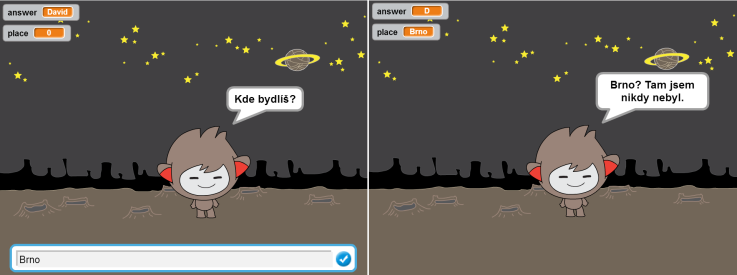
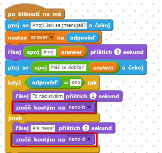
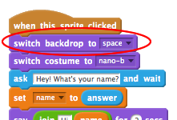

---
title: ChatBot - Povídací robot
level: Scratch 1
language: cs-CZ
stylesheet: scratch
embeds: "*.png"
materials: ["Club Leader Resources/*"]
...

# Úvod { .intro }

V této lekci se naučíš, jak naprogramovat mluvícího robota!

<div class="scratch-preview">
  <iframe allowtransparency="true" width="485" height="402" src="http://scratch.mit.edu/projects/embed/26762091/?autostart=false" frameborder="0"></iframe>
  
</div>

# Krok 1: Tvůj povídací robot { .activity }

## Seznam úkolů { .check }

+ Předtím než začneš dělat mluvícího robota, musíš se rozhodnout jakou bude mít osobnost.
	+ Jaké je jeho jméno?
	+ Kde bydlí?
	+ Je štastný? vážný? veselý? přátelský? stydí se?

+ Vytvoř si nový projekt a smaž kočičku, takže tvůj projekt bude prázdný. Online editor můžeš nalézt zde: <a href="http://jumpto.cc/scratch-new">jumpto.cc/scratch-new</a>.

+ Vyber si jednu z těchto postaviček a přidej je do projektu:

	

+ Vyber si pozadí, které podpoří osobnost robota. Tady je příklad, jak by mohla (ale nemusí) scéna vypadat:

	

## Ulož projekt { .save }

# Step 2: Mluvící robot { .activity }

Nyní když máš robota s osobností, naprogramuj ho, aby mluvil

## Seznam úkolů { .check }

+ Klikni na robota a přidej kód:

	```blocks
		po kliknutí na mě
		ptej se [Ahoj! Jak se jmenuješ?] a čekej
		say [To je krásné jméno!] for (2) secs
	```

+ Klikni na robota, abys ho vyzkoušel(a). Po té co se zeptá na jména, napiš ho do boxíku, který se objeví.

	

+ Robot odpoví pokaždé jen `To je krásné jméno!`. Teď uprav robotovu odpověď tak, aby použil jméno, které napíšeš. Změn robotův kód takto:

	```blocks
		po kliknutí na mě
		ptej se [Ahoj! Jak se jmenuješ?] a čekej
		říkej <spoj [Ahoj] (answer)> příštích (2) sekund
	```

	Abys vytvořil poslední blok, musíš přesunout zelený blok `spoj` {.blockoperators} na fialový blok `říkej` {.blocklooks}.

	

	Pak změn text `hello` na `Ahoj`, a přesuň světle modrý blok `answer` {.blocksensing} (ze sekce 'Vnímání') na text `world`.

	

+ Vyzkoušej program. Funguje jak jsi čekal? Můžeš opravit problém, který se objevil? (Nápověda: přidej někam mezeru!)

+ Pro případ, že bys chtěl zadané jméno použít dále v kódu, musíš ho uložit do proměnné. Vytoř proměnnou nazvanou `name` {.blockdata}. Pokud jsi zapomněl(a) jak se to dělá, podívej se do projektu 'Lovci duchů'.

+ Informace, kterou jsi zadal je uložená do speciální proměnné `answer` {.blocksensing}. Jdi do skupiny Sensing klikni na block answer aby se vedle něj objevilo zatržítko. Hodnota uložená v `answer` {.blocksensing} se objeví v levém horním rohu scény.

+ Jakmile vytvoříte novou proměnnou, upravte kód robota takto:

	```blocks
		po kliknutí na mě
		ptej se [Ahoj! Jak se jmenuješ?] a čekej
		nastav [name v] na (answer)
		říkej <spoj [Ahoj ] (name)> příštích (2) sekund
	```

+ Pokud vyzkoušíš znovu svůj program, zjsitíš, že je hodnota odpovědi uložena v proměnné `name` {.blockdata} a ukazuje se v levém horním rohu scény. Proměnná `name` {.blockdata} bude obsahovat stejnou hodnotu jako proměnná `answer` {.blocksensing}.

	

	Pokud proměnné nechceš na scéně vidět, klikni na ně a odstraň tím zatržítko v levé části.

## Ulož projekt { .save }

## Výzva: Více otázek { .challenge }

Naprogramuj robota tak aby se zeptal na více otázek. Dokážeš uložit odpovědi do proměnných?



## Ulož projekt { .save }

# Step 3: Rozhodování { .activity }

Robota můžeš naprogramovat tak, aby se rozhodoval co dále bude dělat na základě odpovědi.

## Seznam úkolů { .check }

+ Nech se robota zeptat na otázky na které jde odpovědět `ano` nebo `ne`. Tady je příklad:

	```blocks
		po kliknutí na mě
		ptej se [Ahoj! Jak se jmenuješ?] a čekej
		nastav [name v] na (answer)
		říkej <spoj [Ahoj ] (name)> příštích (2) sekund
		ptej se <join [Máš se dobře? ] (name)> and wait
		když ((answer)=[ano]) tak
			říkej [To rád slyším!] příštích (2) sekund
		end
	```

	Všimni si, že jakmile máš jméno uživatele uložené v proměnné, můžeš ho použít kolikrát chceš.

+ Abys vyzkoušel program pořádně, pusť ho dvakrát a jednou odpověz `ne` a jednou `ano`. Odpověď od robota dostaneš jen když odpovíš `ano`.

+ Problém je, že robot neodpoví když  je odpověď `ne`. To můžeš opravit tak, že změníš blok `if` {.blockcontrol} na blok `if/jinak` {.blockcontrol}:

	```blocks
		po kliknutí na mě
		ptej se [Ahoj! Jak se jmenuješ?] a čekej
		nastav [name v] na (answer)
		říkej <spoj [Ahoj ] (name)> příštích (2) sekund
		ask <join [Máš se dobře ] (name)> and wait
		když ((answer)=[ano]) tak
			říkej [To rád slyším!] příštích (2) sekund
		jinak
			říkej [Ale neee!] příštích (2) sekund
		end
	```

+ Když vyzkoušíš svůj kód, zjistíš, že robot odpovídá jak na `ano` tak na `ne`. Robot odpoví `To rád slyším!` na tvoji odpověd `ano`, ale odpověď `Ale neee!` když zadáš cokoliv jiného než `ano` (blok `jinak` {.blockcontrol} znamená 'jinak').

	

+ Do bloku `if` {.blockcontrol} nebo `jinak` {.blockcontrol} můžeš vložit cokoliv, nejen mluvení robota. Například můžeš změnit vzhled robota (kostým) aby odpovídal odpovědi.

	Pokud se podíváš na kostýmy robota, zjistíš, že jich je tam více než jeden. (Pokud ne, můžeš je přidat)

	

	Tyto kostýmy můžeš použít jako část robotovy odpovědi takto:

	

+ Vyzkoušej program a měl bys vidět, že robot mění vzhled dle tvé odpovědi.

	

## Ulož projekt { .save }

## Výzva: Více rozhodování { .challenge }

Naprogramuj robota tak, aby se ptal více otázek - tak aby odpovědi byly `ano` nebo `ne`.


## Ulož projekt { .save }

# Step 4: Změna místa { .activity }

Robota můžeš naprogramovat tak, aby měnil místo, kde se nachází.

## Seznam úkolů { .check }

+ Přidej další kulisy na scénu například měsíc - 'moon'.

	

+ Naprogramuj robota pomocí následujícího kódu:

	```blocks
		ask [Letím na měsíc, chceš jít se mnou?] and wait
		if ((answer) = [ano]) then
			switch backdrop to [moon v]
		end
	```

+ Také potřebuješ přidat kód který zajistí, aby robot začínal ve správných kulisách:

	

+ Otestuj program a odpověz `ano` když se robot zeptá na cestu na měsíc. Měl(a) bys vidět, že se pozadí změní.

	

+ Změní se pozadí když o dpovíš `ne`? Co se stane, když odpovíš `Nejsem si jistý`?

+ Pokud chceš, aby robot poskočil 4x, když odpovíš `ano`, přidej tento kód do bloku `if` {.blockcontrol}:

	```scratch
	repeat (4)
		change y by (10)
		wait (0.1) secs
		change y by (-10)
		wait (0.1) secs
	end
	```

	

+ Vyzkoušej svůj program znovu. Skáče robot nahoru a dolů při odpovědi `ano`?

## Ulož projekt { .save }

## Výzva: Vytvoř si svého vlastního robota {.challenge}
Použij to co ses naučil(a), abys dokončil robota. Tady je pár nápadů:


Jakmile robota dokončíš, nech kamarády, ať ho vyzkouší! Líbí se jim? Jsou s robotem nějaké problémy?

## Ulož projekt { .save }
