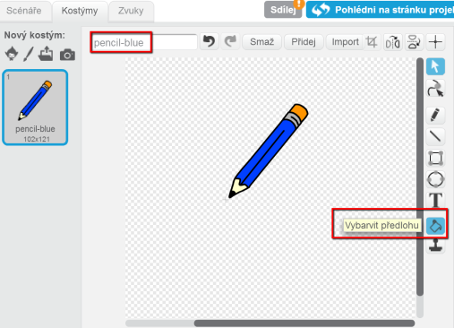
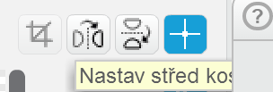
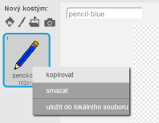
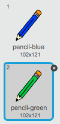
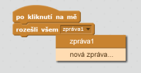
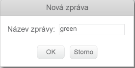
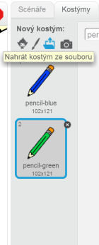
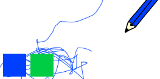
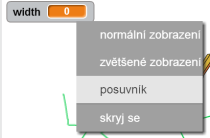
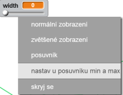

---
title: Kreslící program
level: Scratch 1
language: cs-CZ
stylesheet: scratch
embeds: "*.png"
materials: ["Club Leader Resources/*","Project Resources/*"]
...

# Úvod { .intro }

V této lekci se naučíš vytvořit si vlastní kreslící program!

<div class="scratch-preview">
  <iframe allowtransparency="true" width="485" height="402" src="http://scratch.mit.edu/projects/embed/63473366/?autostart=false" frameborder="0"></iframe>
  
</div>

# Krok 1: Tužka { .activity }

Začnema vytvořením tužky, kterou můžeš kreslit na scénu.

## Seznam úkolů { .check }

+ Vytvoř si nový projekt a smaž kočičku, takže tvůj projekt bude prázdný. Online editor můžeš nalézt zde: <a href="http://jumpto.cc/scratch-new">jumpto.cc/scratch-new</a>.

+ Přidej tužku do projektu

	 

+ Klikni na 'Kostýmy', a vymaž kostým 'pencil-b'.

	 

+ Přejmenuj kostým na 'pencil-blue' a použij nástroj 'Vybarvit předlohu' na vybarvení tužky na modro. 

	 

+ Protože budeš používat myš na kreslení, chceš aby tužka následovala myš navždy = `opakuj dokola` {.blockcontrol}. Přidej tento kód k tužce:

	```blocks
		po kliknutí na ⚑
		opakuj dokola
		  jdi na [ukazatel myši v]
		end
	```

+ Zkus kód kliknutím na zelenou vlakku a pohybováním myši na scéně. Funguje jak jsi čekal?

+ Všiml sis, že myš nesleduje tuhu, ale střed tužky?

	

	Abys to spravil(a), klikni na kostým 'pencil-blue' v postavě tužky a klikni na 'Nastav střed kostýmu'.

	

+ Všimni si kříže, který se objevil. Nyní klikni kousek pod tuhu, abys tento bod nastavil(a) jako střed.

	

+ Klikni na záložku 'Scripts' a otestuj tužku znovu - funguje lépe než předtím?

+ Jako další - nech tužku kreslit `když` {.blockcontrol} - je stisknuto tlačítko myši:

    ```blocks
          po kliknutí na ⚑
          opakuj dokola
            jdi na [ukazatel myši v]
            když (myš stisknuta) tak
              pero dolů
            jinak 
              pero nahoru
            end
          end
	```

+ Vyzkoušej program znovu. Tentokrát pohybuj tužkou po scéně a drž stisknuté tlačítko myši. Můžeš takto kreslit tužkou?

	

## Ulož projekt { .save }

# Krok 2: Barevné tužky { .activity }

Udělej různé barevné tužky a umožni jejich používání a možnost si je vybrat!

## Seznam úkolů { .check }

+ Klikni na postavu tužky, klikni na 'Kostýmy' a zkopíruj postavu 'pencil-blue'.

	

+ Přejmenuj ho na  'pencil-green', a vybarvi jej zeleně.

	

+ Vytvoř dva nové objekty (postavy), které ti umožní vybrat si barvu tužky.

	

+ Když je stisknuto zelené tlačítko, musíš vyslat - `rozešli všem` {.blockevents} zprávu, na kterou zareaguje tužka, a změní kostým a barvu tuhy.

	Abys toho dosáhl(a) přidej tento kód na zelenou tužku:

	```blocks
		po kliknutí na mě
		rozešli všem [green v]
	```

	Abys vytvořil(a) blok pro vyslání zprávy - `rozeslat všem` {.blockevents}, klikni na tlačítko dolů a vyber 'nová zpráva...'.

	

	Napiš 'green' jako tvoji novou zprávu.

	

+ Nyní musíš říct tužce, co má dělat, když dostane zprávu. Přidej tento kód do objektu tužky:

	```blocks
		po obdržení zprávy [green v]
		změň kostým na [pencil-green v]
		nastav barvu pera na [#00ff00]
	```

	Abys nastavil(a) barvu tuhy na zelenou klikni na barevný boxík `nastav barvu pera na` {.blockpen}, a pak klikni na zelené tlačítko, aby se použila jeho barva.

+ To samé udělej nyní pro modré tlačítko, přidáním následujícího kódu:

	```blocks
		po kliknutí na mě
		rozešli všem [blue v]
	```

	...a přidáním tohoto kódu pro postavu tužky:

	```blocks
		po obdržení zprávy [blue v]
		změň kostým na [pencil-blue v]
		nastav barvu pera na [#0000ff]
	```

+ Nakonec potřebuješ říct tužce, jaký si má vybrat kostým a barvu tuhy při startu projektu (a smazat scénu). Přidej tento kód na začátek kódu pro tužku za `po kliknutí na ⚑` {.blockevents} (před smyčku `opakuj dokola` {.blockcontrol}):

	```blocks
		smaž
		změň kostým na [blue-pencil v]
		nastav barvu pera na [#0000ff]
	```

	Můžeš si vybrat jinou barvu pro začátek!

+ Vyzkoušej projekt. Funguje nyní přepínání mezi modrou a zelenou tužkou?

	

## Ulož projekt { .save }

# Krok 3: Dělání chyb { .activity .new-page }

Občas se stane chyba a proto přidáme tlačítko 'smazat' a gumu do projektu.

## Seznam úkolů { .check }

+ Přidej tlačítko pro smazání celé scény. Přidej postavu (písmeno) 'X-block' na scénu a nabarvi ji na červeno.

	

+ Přidej tento kód k tlačítku:

	```blocks
		po kliknutí na mě
		smaž
	```

	Všimni si, že tady neposíláme žádnou zprávu, protože na scéně není žádný objekt, který by měl tuto činnost dělat.

+ Vytvoř gumu pro mazání. Pokud jsi od vedoucího dostal soubory se zdroji, klikni 'Nahrát kostým ze souboru' a přidej obrázek 'eraser.svg'.

	
	
	Pokud obrázek eraser.svg nemáš, nakresli si vlastní!

+ Přidej obrázek gumy jako nové tlačítko. Takto by měla vypadat tvoje scéna:

	

+ Nyní přidej kód k tlačítku gumy, abys řekl(a) tužce, že se má změnit na gumu.

	```blocks
		po kliknutí na mě
		rozešli všem [eraser v]
	```

+ Když tužka dostane zprávu, musí se změnit na gumu přepnutím kostýmu a nastavením barvy tuhy na stejnou, jakou barvu má scéna!

	```blocks
		po obdržení zprávy [eraser v]
		změň kostým na [eraser v]
		nastav barvu pera na [#FFFFFF]
	```  

+ Vyzkoušej projekt abys viděl, jestli guma maže.

	

+ Možná sis všiml problému, že můžeš kreslit kdekoliv včetně blízkosti tlačítek na výběr!

	

	Abys to opravil musíš tužce říct, že má kreslit jen když je stisknuté tlačítko myši _a_ když je y-pozice myši větší než -110 (`souřadnice myši y`{.blocksensing}`> -120` {.blockoperators}). Změň blok `když` {.blockcontrol} tužky takto:
    
    ```blocks
		po kliknutí na ⚑
		opakuj dokola
            jdi na [ukazatel myši v]
            když (((myš stisknuta) a (souřadnice myši y)) > [-120]) tak          
                pero dolů
            jinak 
                pero nahoru
            end
        end
	```

+ Vyzkoušej projekt; nyní bys nemělo být možné kreslit blízko tlačítek.

	

## Ulož projekt { .save }

# Krok 4: Změna šířky tuhy { .activity .new-page }

Dovol uživatelům kreslit různou velikostí tuhy.

## Seznam úkolů { .check }

+ Jako první přidej novou proměnnu nazvanou 'width'. pokud nevíš jak, podívej se do projektu 'Lovci duchů'.

+ Přidej tento řádek _dovnitř_ cyklu `opakuj dokola` {.blockcontrol} v kódu tužky:

	```blocks
		nastav tloušťku pera na (width)
	```

	Šířka tuhy bude nyní opakovaně nastavována podle proměnné 'width'.

+ Hodnotu uloženou v proměnné můžeš změnit kliknutím pravého talčítka myši na proměnné a (na scéně) a vybráním 'posuvník'.

	

	Nyní pohybuj posuvníkem pod proměnnou pro změnu hodnoty.

	

+ Vyzkoušej projekt abys viděl zda jde měnit šířka tuhy.

	

	Pokud chceš omezit minimální a maximální hdonotu proměnné 'width' klikni pravým tlačítkem myši na proměnnou a vyber 'nastav u posuvníku min a max'. Nastav minimum a maximum na hodnoty 1 a 20.

	

	Zkoušej proměnnou 'width' dokud nejsi spokojený(á).

## Ulož projekt { .save }

## Výzva: Zkratky { .challenge }
Zkus přidat klávesová zkratky, například:

+ m = změní barvu na modrou
+ z = změní barvu na zelenou
+ g = změní tužku na gumu
+ s = smaže scénu

Také můžeš použít šipky na změnu šířky tuhy!

## Ulož projekt { .save }

## Výzva: Více tužek { .challenge }
Zkus přidat červenou, žlutou a černou tužku. Obrázky najdeš ve složce 'Resources'. Nezapomeň přidat klávesové zkratky!

Zkusíš teď nakreslit obrázek?


