# Einleitung { .intro }

In diesem Projekt lernst du, wie du deine eigenen Musikinstrumente programmieren kannst!

<div class="scratch-preview">
	<iframe allowtransparency="true" width="485" height="402" src="http://scratch.mit.edu/projects/embed/26741186/?autostart=true" frameborder="0"></iframe>
	
</div>

# Schritt 1: Eine Trommel programmieren { .activity }

Lass uns zuerst eine Trommel entwickeln, die einen Klang von sich gibt, wenn du drauf schlägst.

## Arbeitsschritte { .check }

+ Öffne ein neues Scratch-Projekt und lösche die Figur mit der Katze, so dass dein Projekt leer ist.

+ Füge eine Trommel-Figur zu deinem leeren Projekt hinzu und suche ein Hintergrundbild für die Bühne, das zum Thema passt.

	

	Wenn du dir nicht sicher bist, wie das gemacht wird, dann schau dir das vorherige Projekt ("Verloren im Weltall") an!

+ Lass uns die Trommel so programmieren, dass sie einen Klang abspielt, wenn man drauf klickt. Stelle sicher, dass die Trommel ausgewählt ist, und füge diesen Code hinzu:

	```blocks
		Wenn ich angeklickt werde
		spiele Schlaginstrument (1 v) für (0.25) Schläge
	```

+ Klicke auf die Trommel, um dein neues Instrument zu testen!

+ Du kannst auch ändern, wie die Trommel aussieht wenn man drauf klickt. Dazu braucht die Trommel ein zweites Kostüm. Klick zuerst auf 'Kostüme', um das aktuelle Bild der Trommel zu sehen.

	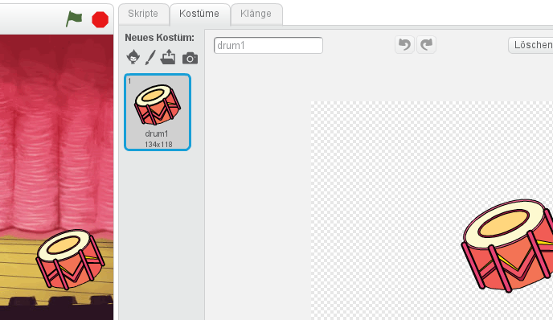

+ Klicke mit der rechten Maustaste auf das Kostüm und dann auf 'Duplizieren', um eine Kopie des Kostüms zu erstellen.

	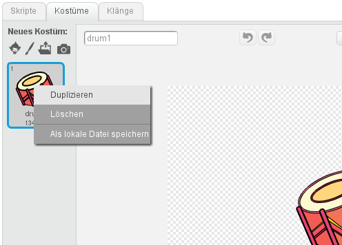

+ Klicke auf das neue Kostüm ('drum2'), wähle das Linien-Werkzeug aus, und zeichne dann ein paar Linien, damit es so aussieht als ob die Trommel einen Klang von sich gäbe.

	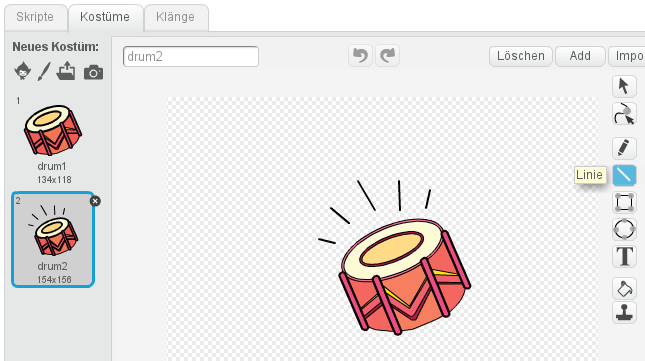

+ Die Namen der Kostüme sind derzeit nicht besonders hilfreich. Benenne die 2 Kostüme um in 'nicht geschlagen' und 'geschlagen' indem du die Namen in das Textfeld des jeweiligen Kostüms eingibst.

	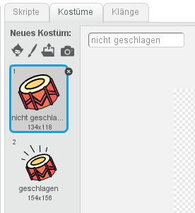

+ Weil es jetzt 2 unterschiedliche Kostüme für die Trommel gibt, kannst du nun auswählen welches Kostüm angezeigt wird! Füge diesen Code zu deiner Trommel hinzu:

	```blocks
		Wenn die grüne Flagge angeklickt
		wechsle zu Kostüm [nicht geschlagen v]

		Wenn ich angeklickt werde
		wechsle zu Kostüm [geschlagen v]
		spiele Schlaginstrument (1 v) für (0.25) Schläge
		wechsle zu Kostüm [nicht geschlagen v]
	```

	Den Code-Block zum Wechseln des Kostüms findest du im Bereich `Aussehen` {.blocklooks}.

+ Wenn die Trommel angeklickt wird sollte sie jetzt das Kostüm wechseln, damit man sieht dass sie einen Ton von sich gibt, und dann wieder zurückwechseln.

## Speichere dein Projekt { .save }

##Herausforderung: Deine Trommel verbessern { .challenge }

+ Kannst du den Klang ändern, den die Trommel von sich gibt, wenn sie angeklickt wird?


+ Kannst du auch die Trommel dazu bringen, einen Klang von sich zu geben, wenn die Leertaste gedrückt wird? Dazu benötigst du diesen Block aus dem Bereich `Ereignisse` {.blockevents}:

```blocks
	Wenn Taste [Leertaste v] gedrückt
```

Du kannst den existierenden Code kopieren, indem du mit der rechten Maustaste drauf klickst und 'Duplizieren' wählst.

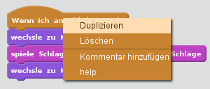

## Speichere dein Projekt { .save }

# Schritt 2: Eine Sängerin programmieren { .activity .new-page }

Lass uns jetzt eine Sängerin zu unserer Band hinzufügen!

## Arbeitsschritte { .check }

+ Füge 2 weitere Figuren zu deiner Bühne hinzu: eine Sängerin und ein Mikrofon.

	

+ Bevor du deine Sängerin zum Singen bringen kannst, musst du einen Klang zu deiner Figur hinzufügen. Stelle sicher, dass du die Sängerin ausgewählt hast, und klicke auf 'Klänge und dann auf 'Klang aus der Bibliothek wählen':

	

+ Wenn du links auf 'Gesang' klickst, kannst du einen passenden Klang für deine Figur auswählen.

	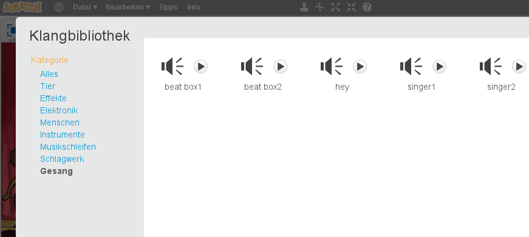

+ Weil der Klang jetzt hinzugefügt wurde, kannst du diesen Code zu deiner Sängerin hinzufügen:

	```blocks
		Wenn ich angeklickt werde
		spiele Klang [singer1 v] ganz
	```

+ Klicke auf die Sängerin, um sicherzustellen, dass sie singt, wenn sie geklickt wird.

## Speichere dein Projekt { .save }

#{ .new-page }
+ Du kannst auch das Kostüm der Sängerin wechseln, damit man bemerkt, wenn sie singt. Klicke mit der rechten Maustaste auf das Kostüm und wähle 'Duplizieren', damit du genau so wie bei der Trommel eine Kopie hast. Benenne die zwei Kostüme um in 'singt nicht' und 'singt'.

	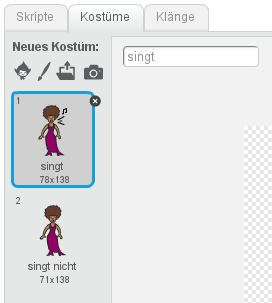

+ Zeichne ein paar Linien neben den Mund der Sängerin. Die Sängerin sollte ungefähr so aussehen:

	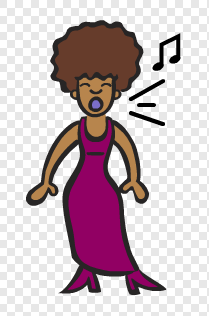

+ Füge jetzt diesen Code zu deiner Sängerin hinzu, damit ihr Kostüm wechselt, wenn sie angeklickt wird:

	```blocks
		Wenn die grüne Flagge angeklickt
		wechsle zu Kostüm [singt nicht v]

		Wenn ich angeklickt werde
		wechsle zu Kostüm [singt v]
		spiele Klang [singer1 v] ganz
		wechsle zu Kostüm [singt nicht v]
	```

+ Klicke auf die Sängerin, um zu testen, ob dein neuer Code funktioniert.

## Speichere dein Projekt { .save }

# Schritt 3: Ein Becken programmieren { .activity .new-page }

Bisher haben wir für alle Instrumente fertige Bilder aus der Scratch-Bibliothek benutzt. Warum nicht eine eigene Figur zeichnen?

## Arbeitsschritte { .check }

+ Um dein eigenes Bild für das Becken zu zeichnen, klicke auf das 'Neue Figur zeichnen' Symbol mit dem Pinsel.

	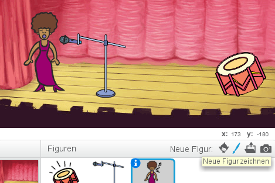

+ Wie du siehst, hast du jetzt eine leere Figur namens 'Figur1'. Zeichne das Becken in 'Kostüm1', indem du eine gelbe Ellipse und ein paar schwarze Linien zeichnest. Du solltest dieses Kostüm auch in 'nicht geschlagen' umbenennen, wie bei den anderen Figuren.

	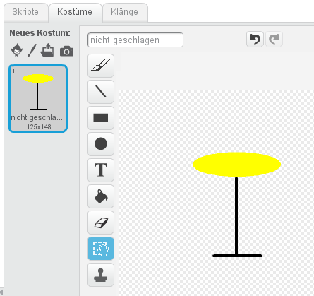

+ Dupliziere das Becken-Kostüm, um ein zweites Kostüm zu erstellen, und benenne es um in 'geschlagen'.

+ Damit das Becken so aussieht, als ob es geschlagen wurde, kannst du es drehen. Um das zu tun, klicke auf das 'Auswählen'-Werkzeug und ziehe es, um das Becken zu markieren. Du kannst danach den runden 'Dreh'-Griff ziehen, um das Becken zu drehen.

	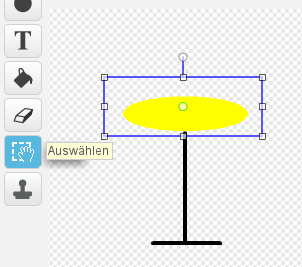

	Die Becken-Kostüme sollten ungefähr so aussehen:

	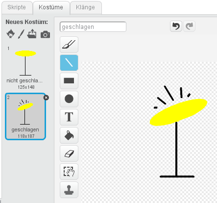

+ Das Becken ist wahrscheinlich etwas zu groß. Klicke auf das 'Verkleinern'-Symbol, woraufhin sich der Mauszeiger verändert. Klicke einige Mal auf das Becken, um es zu verkleinern. Du kannst das Becken auch verschieben, um ihm auf der Bühne einen besseren Platz zu geben.

	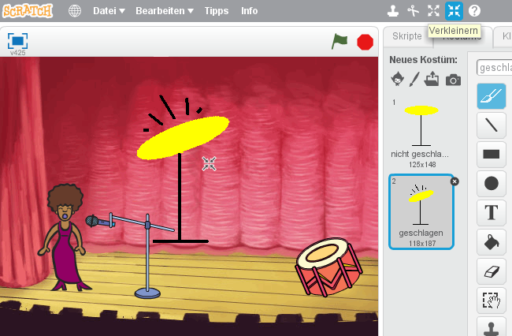

+ Als nächstes solltest du den Namen der Figur umändern, weil 'Figur1' kein besonders hilfreicher Name ist! Klicke auf das Symbol für die Becken-Figur und dann auf das blaue `i` {.blockmotion} (Information) oben links.

	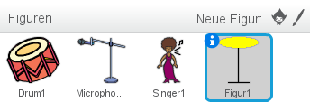

	Du kannst jetzt den Namen der Figur in etwas Sinnvolles, wie 'Becken', umändern!

+ Da die Bilder jetzt fertig sind, kannst du einen Klang zur Becken-Figur hinzufügen. Klicke auf 'Klang aus der Bibliothek wählen', dann auf 'Schlagwerk' und wähle den 'cymbal crash'-Klang.

	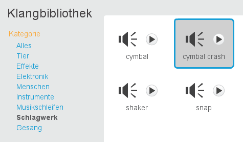

+ Füge diesen Code zum Becken hinzu, so dass es einen Klang von sich gibt und das Kostüm wechselt, wenn es angeklickt wird:

	```blocks
		Wenn die grüne Flagge angeklickt
		wechsle zu Kostüm [not hit v]

		Wenn ich angeklickt werde
		wechsle zu Kostüm [hit v]
		spiele Klang [cymbal crash v] ganz
		wechsle zu Kostüm [not hit v]
	```

+ Teste das Becken, um zu sehen ob es funktioniert!

## Speichere dein Projekt { .save }

# Schritt 4: Hintergrundmusik { .activity .new-page }

Du kannst Hintergrundmusik hinzufügen, die deine Band begleitet!

## Arbeitsschritte { .check }

+ Klicke auf die Bühne, dann auf 'Klänge' und dann auf 'Klang aus der Bibliothek wählen', um Musik zu deiner Bühne hinzuzufügen. Die Musik findest du im Bereich 'Musikschleifen'.

+ Füge diesen Code zu deiner Bühne hinzu und denk daran, die Musik auszuwählen, die du ausgesucht hast:

	```blocks
		Wenn die grüne Flagge angeklickt
		wiederhole fortlaufend
		spiele Klang [eggs v] ganz
		Ende
	```

+ Dieser Code spielt die Musik, die du ausgewählt hast, in einer Schleife. Klick auf die Flagge, und probier es aus!

+ Du kannst sogar diesen Code zu deiner Bühne hinzufügen, damit du die Hintergrundmusik stumm schalten oder wieder laut schalten kannst, indem du die Tasten 'm' und 'u' benutzt:

	```blocks
		Wenn die grüne Flagge angeklickt
		setze Lautstärke auf (100)%
		wiederhole fortlaufend
		spiele Klang [eggs v] ganz
		Ende

		Wenn Taste [m v] gedrückt
		setze Lautstärke auf (0)%

		Wenn Taste [u v] gedrückt
		setze Lautstärke auf (100)%
	```

## Speichere dein Projekt { .save }

##Herausforderung: Erstelle deine eigene Band { .challenge }
Benutze das, was du in diesem Projekt gelernt hast, um deine eigene Band zu erstellen! Du kannst alle Instrumente erstellen, die dir gefallen, aber schau dir zuerst die verfügbaren Töne und Instrumente an, um ein paar Ideen zu bekommen.


Deine Instrumente müssen auch nicht unbedingt sinnvoll sein. Du kannst beispielsweise ein Klavier aus Muffins erstellen!


Kanns du dein eigenes Lied komponieren, oder mit Freunden eine Band zusammenstellen?

## Speichere dein Projekt { .save }

