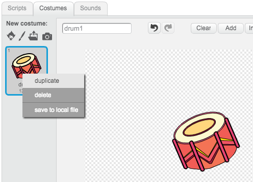
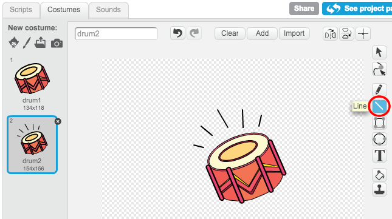
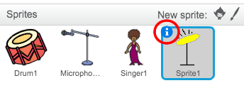

---
title: Rock Band
level: Scratch 1
language: en-GB
stylesheet: scratch
embeds: "*.png"
materials: ["Club Leader Resources/*.*"]
...

# Introduction { .intro }

In this project you'll learn how to code your own musical instruments!

<div class="scratch-preview">
	<iframe allowtransparency="true" width="485" height="402" src="http://scratch.mit.edu/projects/embed/26741186/?autostart=true" frameborder="0"></iframe>
	
</div>

# Step 1: Coding a Drum { .activity }

First, let's make a drum that makes a sound when it's hit.

## Activity Checklist { .check }

+ Start a new Scratch project, and delete the cat sprite so that your project is empty. You can find the online Scratch editor at <a href="http://jumpto.cc/scratch-new">jumpto.cc/scratch-new</a>.

+ Add a drum sprite to your blank project, as well as adding a suitable backdrop image to the stage.

	

	If you're not sure how to do this, the previous project ("Lost in Space") will help you!

+ Let's program the drum to play a sound when it's clicked. Make sure the drum sprite is selected and add this code:

	```blocks
		when this sprite clicked
		play drum (1 v) for (0.25) beats
	```

+ Click the drum to try out your new instrument!

+ You can also change how the drum looks when it's clicked, by creating a new costume. Click the 'Costumes' tab, and you'll see the drum image.

	

+ Right-click on the costume and click 'duplicate' to create a copy of the costume.

	

+ Click on the new costume (called 'drum2') and then select the line tool and draw lines to make it look like the drum is making a sound.

	

+ The names of the costumes aren't very helpful at the moment. Rename the 2 costumes to 'not hit' and 'hit' by typing the new name of each costume into the text box.

	

+ Now that you have 2 different costumes for your drum, you can choose which costume is displayed! Add this code to your drum:

	```blocks
		when flag clicked
		switch costume to [not hit v]

		when this sprite clicked
		switch costume to [hit v]
		play drum (1 v) for (0.25) beats
		switch costume to [not hit v]
	```

	The code block for changing the costume is in the `Looks` {.blocklooks} section.

+ When clicked, your drum should now change costumes, to look like it's been hit, and then change back again.

## Save your project { .save }

##Challenge: Improving your drum { .challenge }

+ Can you change the sound that the drum makes when it's clicked?


+ Can you also get the drum to make a sound when the spacebar is pressed? You'll need to use this `event` {.blockevents} block:

```blocks
	when [space v] key pressed
```

You can copy your existing code by right-clicking on it and clicking 'duplicate'.


## Save your project { .save }

# Step 2: Coding a Singer { .activity .new-page }

Let's add a singer to our band!

## Activity Checklist { .check }

+ Add another 2 sprites to your stage; a singer and a microphone.

	

+ Before you can make your singer sing, you need to add a sound to your sprite. Make sure that you have selected your singer, then click the 'Sounds' tab, and click 'Choose sound from library':

	

+ If you click 'Vocals' on the left hand side, you will then be able to choose a suitable sound to add to your sprite.

	

+ Now that the sound has been added, you can add this code to your singer:

	```blocks
		when this sprite clicked
		play sound [singer1 v] until done
	```

+ Click on your singer, to make sure that she sings when clicked.

## Save your project { .save }

+ You can also change the costume of your singer, to make it look like she is singing. Just like with the drum, right-click on the costume to duplicate it, so that you have 2. Rename the 2 costumes to 'not singing' and 'singing'.

	

+ Add some lines near your singer's mouth. Your singer should look something like this:

	

+ Now add code to change your singer's costume when clicked:

	```blocks
		when flag clicked
		switch costume to [not singing v]

		when this sprite clicked
		switch costume to [singing v]
		play sound [singer1 v] until done
		switch costume to [not singing v]
	```

+ Click on your singer, to test that your new code works.

## Save your project { .save }

# Step 3: Coding a cymbal { .activity .new-page }

So far all of your instruments have used images from the Scratch library. Why not draw a sprite of your own!

## Activity Checklist { .check }

+ To draw your own cymbal sprite, click on the 'Paint new sprite' icon.

	

+ As you can see, you now have a blank sprite called 'Sprite1'. Draw your cymbal in 'costume1', using a yellow ellipse and some black lines. You should also rename this costume 'not hit', just like with your other sprites.

	

+ Duplicate your cymbal costume to create a second costume, and remember to name it 'hit'.

+ To make your cymbal look like it's been hit, you can rotate it. To do this, click the 'Select' tool and drag to highlight the cymbal. You can then click and drag the circular 'rotate' handle to rotate the cymbal.

	

	Your cymbal costumes should look something like this:

	

+ Your cymbal is probably a bit too big. Click the 'Shrink' icon, and you should notice that the mouse cursor changes. Click on your cymbal a few times to shrink it. You can also move your cymbal to a better place on the stage.

	

+ Next, you should change the name of the sprite, as 'sprite1' isn't a very helpful name! Click the icon for your cymbal sprite, and then click on the blue `i` {.blockmotion} (information) icon in the top-left.

	

	You can then change the sprite name to something more useful, like 'Cymbal'!

+ Now that you have your graphics made, you can add in a sound to the cymbal sprite. Click 'Choose sound from library', and then click 'Percussion' and choose the 'cymbal crash' sound.

	

+ Add this code to the cymbal, so that it makes a sound and changes costume when clicked:

	```blocks
		when flag clicked
		switch costume to [not hit v]

		when this sprite clicked
		switch costume to [hit v]
		play sound [cymbal crash v] until done
		switch costume to [not hit v]
	```

+ Test out your cymbal, to see if it works!

## Save your project { .save }

# Step 4: Backing music { .activity .new-page }

You can even add some music for your band to play along to!

## Activity Checklist { .check }

+ Click on the stage, and then click the 'Sounds' tab and then 'Choose sound from library' to add some music to the stage. The music is in the 'Music Loops' section.

+ Add this code to your stage, remembering to select the sound that you chose:

	```blocks
		when flag clicked
		forever
			play sound [eggs v] until done
		end
	```

+ This code repeatedly plays the music that you have chosen. Click the flag to test it out!

+ You can even add this code to your stage, to allow you to mute and unmute the background music using the 'm' and 'u' keys:

	```blocks
		when flag clicked
		set volume to (100)%
		forever
			play sound [eggs v] until done
		end

		when [m v] key pressed
		set volume to (0)%

		when [u v] key pressed
		set volume to (100)%
	```

## Save your project { .save }

##Challenge: Make your own band { .challenge }
Use what you've learnt in this project to make your own band! You can create any instruments you like, but look at the available sounds and instruments to get some ideas.


Your instruments don't have to be sensible though. For example, you could make a piano made out of muffins!


Can you make your own song, or even get together with your friends to make a band?

## Save your project { .save }


