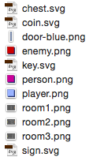
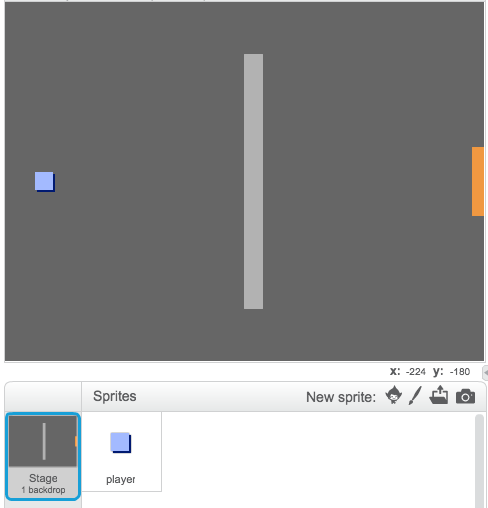
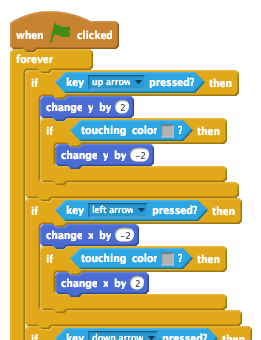
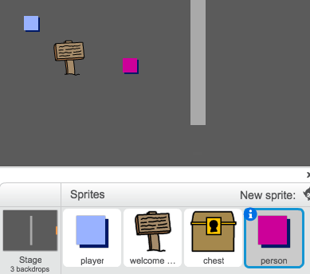
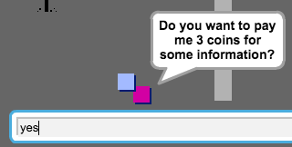

# Introduction { .intro }

In this project you'll learn how to create your own open world adventure game.

<div class="scratch-preview">
  <iframe allowtransparency="true" width="485" height="402" src="https://scratch.mit.edu/projects/embed/34248822/?autostart=false" frameborder="0"></iframe>
  
</div>

# Step 1: Coding your player { .activity }

Let's start by creating a player that can move around your world.

## Activity Checklist { .check }

+ Start a new Scratch project, and delete the cat sprite so that your project is empty. You can find the online Scratch editor at <a href="http://jumpto.cc/scratch-new">jumpto.cc/scratch-new</a>.

+ For this project, you should have a 'Project Resources' folder, containing all of the images you'll need. Make sure that you can find this folder, and ask your club leader if you can't find it.

	

+ Add the image 'room1.png' as a new stage backdrop, and the image 'player.png' as a new sprite. If you don't have these images you can draw them yourself! Here's how your project should look:

	

+ Let's use the arrow keys to move the player around. When the player presses the up arrow, you want the player to move up, by changing its y coordinate. Add this code to the player sprite:

	```blocks
		when flag clicked
		forever
			if <key [up arrow v] pressed? > then
				change y by (2)
			end
		end
	```

+ Test out your player by clicking the flag and then holding down the up arrow. Does your player move up?

	

+ To move the player to the left, you need to add another `if` {.blockcontrol} block to your player, which changes the x coordinate:

	```blocks
		when flag clicked
		forever
			if <key [up arrow v] pressed? > then
				change y by (2)
			end
			if <key [left arrow v] pressed? > then
				change x by (-2)
			end
		end
	```

## Challenge: Moving in all four directions {.challenge}
Can you add more code to your player, so that they can move up, down, left and right. Use the code you already have to help you!

## Save your project { .save }

+ Test out your player again, and you'll see they have the ability to walk through the light grey walls.

	

+ To fix this, you need to move the player, but then move them back if they're touching a light grey wall. Here's the code you'll need:

	```blocks
		when flag clicked
		forever
			if <key [up arrow v] pressed? > then
				change y by (2)
				if < touching color [#BABABA]? > then
					change y by (-2)
				end
			end
		end
	```

	Notice that the new `if`{.blockcontrol}`touching color`{.blocksensing} block is _inside_ the `if`{.blockcontrol}`key [up arrow]`{.blocksensing} block.

+ Test this new code by moving below the wall - you shouldn't be able to move up into it.

	

+ Let's do the same for the left arrow, moving back if the player is touching a wall. This is how your player code should look so far:

	

## Challenge: Fixing your player's movement {.challenge}
Add code to your player so that you can't walk through walls in any direction. Use the code you already have to help you!

## Save your project { .save }

# Step 2: Coding your world { .activity }

Let's allow the player to walk through doors into other rooms!

## Activity Checklist { .check }

+ Add 2 more backdrops to your stage ('room2.png' and 'room3.png'), so that you have 3 backdrops in total. Make sure that they are in the right order - this will help you later.

	

+ You'll need a new variable called `room` {.blockdata}, to keep track of what room the player is in.

	

+ When the player touches the orange door in the first room, the next backdrop should be displayed, and the player should move back to the left side of the stage. Here's the code you'll need - it should go inside the player's `forever` {.blockcontrol} loop:

	```blocks
		if < touching color [#F2A24A] > then
			switch backdrop to [next backdrop v]
			go to x: (-200) y: (0)
			change [room v] by (1)
		end
	```

+ Add this code to the _start_ of your player code (before the `forever` {.blockcontrol} loop) to make sure that everything is reset when the flag is clicked:

	```blocks
		set [room v] to (1)
		go to x: (-200) y: (0)
		switch backdrop to [room1 v]
	```

+ Click the flag and move your player over the orange door. Does your player move to the next screen? Does the `room` {.blockdata} variable change to 2?

	

## Challenge: Moving to the previous room {.challenge}
Can you make your player move to the previous room when they touch a yellow door? Remember that this code will be _very_ similar to the code you've already added for moving to the next room.

## Save your project { .save }

# Step 3: Signs { .activity }

Let's add signs to your world, to guide your player on their journey.

## Activity Checklist { .check }

+ Upload the image 'sign.svg' as a new sprite, and rename the sprite 'welcome sign'.

	

+ This sign will only be visible in room 1, so let's add some code to the sign to make sure that this happens:

	```blocks
		when flag clicked
		forever
			if < (room) = [1] > then
				show
			else
				hide
			end
		end
	```

+ Test your sign by moving between rooms. Your sign should only be visible in room 1.

	

+ A sign isn't much good if it doesn't say anything! Let's add some more code (in another separate block) to display a message if the sign is touching the player:

	```blocks
		when flag clicked
		forever
			if < touching [player v]? > then
				say [Welcome! Can you get to the treasure?]
			else
				say []
			end
		end
	```
+ Test out your sign, and you should see a message when the player touches it.

	

## Save your project { .save }

## Challenge: Treasure! {.challenge}
Can you add a new treasure chest sprite, using the image 'chest.svg'. This treasure chest should be placed in room 3, and should say 'Well done!' when the player touches it.


## Save your project { .save }

# Step 4: People { .activity }

Let's add other people to your world that your player can interact with.

## Activity Checklist { .check }

+ Add in a new person sprite, using the image 'person.png'.

	

+ Add in this code, so that the person talks to your player. This code is very similar to the code you added to your sign:

	```blocks
		when flag clicked
		go to x: (-200) y: (0)
		forever
			if < touching [player v]? > then
				say [Did you know that you can go through orange and yellow doors?]
			else
				say []
			end
		end
	```

+ You could also allow your person to move, by using these two blocks:

	```blocks
		move (1) steps
		if on edge, bounce
	```

	Your person will act differently, depending on whether you place this code inside the `forever` {.blockcontrol} loop or the `if` {.blockcontrol} block. Try both and see which you prefer.

	

+ Have you noticed that your person flips upside-down. To stop this, click the sprite's information icon (`i`{.blockmotion}), and click the dot to fix to rotation style.

	

## Challenge: Improving your person {.challenge}
Can you add code to your new person, so that they only appear in room 1? Make sure you test out your new code!

## Save your project { .save }

+ You can also add in patrolling enemies, who end the game if the player touches them. Add in a new enemy sprite, and change the rotation style, just like you did with the 'person' sprite.

+ Add code to your enemy, so that they only appear in room 2.

+ You'll also need to add code to move the enemy, and to end the game if the enemy touches the player. It's easier to do this in separate code blocks. Here's how your enemy code should look:

	

+ Test out your enemy, to make sure that:
	+ It's only visible in room 2;
	+ It patrols the room;
	+ The game ends if the player touches it.

## Save your project { .save }

## Challenge: More enemies {.challenge}
Can you create another enemy in room 3, that patrols up and down through the gap in the wall?


## Save your project { .save }

# Step 5: Collecting coins { .activity }

## Activity Checklist { .check }

+ Add a new variable valled `coins` {.blockdata} to your project.

+ Add a new 'coin' sprite to your project.


+ Add code to your coin, so that it only appears in room 1.

+ Add code to your coin sprite, to add 1 to your `coins` {.blockdata} once they've been picked up:

	```blocks
		when flag clicked
		wait until <touching [player v]?>
		change [coins v] by (1)
		stop [other scripts in sprite v]
		hide
	```

	The code `stop other scripts in sprite` {.blockcontrol} is needed so that the coin stops being displayed in room 1 once it's been collected.

+ You'll also need to add code to set your `coins` {.blockdata} variable to 0 at the start of your game.

+ Test your project - collecting your coins should change your score to 1.

## Challenge: More coins {.challenge}
Can you add more coins to your game? They can be in different rooms, and some coins could even be guarded by patroling enemies.

# Step 6: Doors and keys { .activity }

## Activity Checklist { .check }

+ Create a new sprite from your 'key-blue.svg' image. Switch your stage to backdrop 3, and place the key somewhere difficult to reach!

 	

+ Make sure that your key is only visible in room 3.

+ Create a new list variable called `inventory` {.blockdata}. This will be where you store all of the items your player collects.

+ The code for collecting the key is very similar to the code for collecting coins. The difference is that you add the key to your inventory.

	```blocks
		when flag clicked
		wait until <touching [player v]?>
		add [blue key] to [inventory v]
		stop [other scripts in sprite v]
		hide
	```

+ Test out your key, to see if you can collect it, and add it to your inventory. Remember to add code to your stage to empty your inventory at the start.

	```blocks
		delete (all v) of [inventory v]
	```

+ Create a new sprite from your 'door-blue.png' image, and place your blue door across the gap in the two walls.

	

+ Add code to your door, so that it is only visible in room 3.

+ You'll need to hide your blue door to allow your player to pass once you have the blue key in your inventory.

	```blocks
		when flag clicked
		wait until <[inventory v] contains [blue key]>
		stop [other scripts in sprite v]
		hide
	```

+ Test out your project, and see if you can collect the blue key to open the door!

## Save your project { .save }

## Challenge: Create your own world {.challenge}
You can now continue creating your own world. Here are some ideas:

+ Change the setting of your game, and your game graphics;
+ Add sound and music to your game;
+ Add more people, enemies, signs and coins;
+ Add red and yellow doors, that need their own keys to open them;
+ Add more rooms to your world;
+ Add other useful items to your game;

+ Use coins to get information from other people;

	

+ You could even add north and south doors, so that the player can move between rooms in all 4 directions. For example, if you had 9 rooms, you could think of them as being in a 3x3 grid. You can then add 3 to the room number to move down 1 level.

	

## Save your project { .save }

