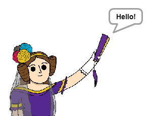
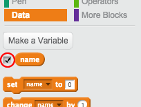
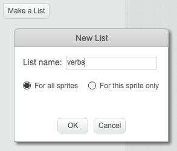
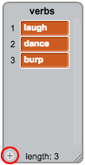
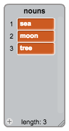
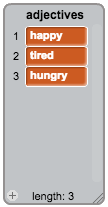
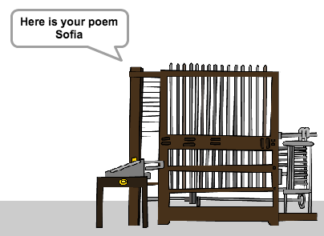

# Introduction { .intro }

You are going to learn how to program your own poetry generator!

<div class="scratch-preview">
  <iframe allowtransparency="true" width="485" height="402" src="https://scratch.mit.edu/projects/embed/77844926/?autostart=false" frameborder="0"></iframe>
  
</div>

# Step 1: Ada Lovelace { .activity }

In 1842, Ada Lovelace wrote about using a machine called the 'Analytical Engine' to make calculations, and is seen as the world's first computer programmer! Ada was also the first to see that computers could be more than just big calculators.

## Activity Checklist { .check }

+ Open the 'Poetry Generator' Scratch project. Your club leader will give you a copy of this project, or you can open it online at <a href="http://jumpto.cc/poetry-resources" target="_blank">jumpto.cc/poetry-resources</a>.

+ Click on your 'Ada' sprite, and click the `Events` {.blockevents} tab in the 'Scripts' coding section. Drag the `when this sprite clicked` {.blockevents} block onto the coding area on the right.


Any code added underneath this block will run when Ada is clicked!

+ Click the `Looks` {.blocklooks} tab, and drag the `say` {.blocklooks} `Hello!` `for 2 secs` {.blocklooks} block underneath the code you've already added.


+ Click on Ada, and you should see her talk to you.



## Challenge: Code Ada to introduce herself {.challenge}
Can you change your code, so that Ada says 'Hi, I'm Ada!' when you click on her?


## Save your project { .save }

# Step 2: Telling Ada your name { .activity }

Ada has introduced herself, but she doesn't know your name!

## Activity Checklist { .check }

+ Drag an `ask` {.blocksensing} block (from the `sensing` {.blocksensing} section) onto your code. Here's how your code should look:

```scratch
when this sprite clicked
say [Hi, I'm Ada!] for (2) secs
ask [What's your name?] and wait
```

+ Click on Ada to test your code. Ada should ask you your name, which you can type in!


+ We can use a __variable__ to store your name. Click `Data` {.blockdata}, and then 'Make a Variable'. As this variable will be used to store your name, let's call the variable... `name` {.blockdata}!


+ To store your name, click the `Data` {.blockdata} tab, and then drag the `set name` {.blockdata} block onto the end of your code.


+ Use the `answer` {.blocksensing} block to store the answer you type in.


+ Click on Ada to test your code, and enter your name when asked. You should see that your name has been stored in the `name` {.blockdata} variable.


+ You can now make use of your name in your code. Add this code:

```scratch
say (join [Hi ] (name))
```

To create this code, first drag a `join` {.blockoperators} block onto the `say` {.blocklooks} block, and then add your `name` {.blockdata} block onto the `join` {.blockoperators} block.


+ To hide your `name` {.blockdata} variable on the stage, click the tick next to the variable.



+ Test your new code. Ada should say hello to you, using your name!


If there's no space between the word 'Hi' and your name, you'll need to add a space into the code yourself!

+ Finally, add this code to explain what to do next:

```scratch
say [Click the computer to generate a poem!] for (2) secs
```

+ Test Ada's code one last time, to make sure that everything works. Here's How your code should look:

```scratch
when this sprite clicked
say [Hi, I'm Ada!] for (2) secs
ask [What's your name?] and wait
set [name v] to (answer)
say (join [Hi ] (name)) for (2) secs 
say [Click the computer to generate a poem.] for (2) secs 
```

## Save your project { .save }

# Step 3: The Analytical Engine { .activity .new-page }

Let's program Ada's computer (called the 'Analytical Engine') to generate poetry.

## Activity Checklist { .check }

+ Add this code to your 'Computer' sprite, so that it speaks when clicked:

```scratch
when this sprite clicked
say [Here is your poem...] for (2) secs
```

+ To create a random poem, first you'll need a __list__ of words to use. To create a new list, click the `Data` {.blockdata} tab.

Let's use __verbs__ (action words) in the first line of your poem. Create a new list called 'verbs'.



+ Your new list will be empty. Click the `+` at the bottom of your empty list and add these verbs:



+ The first line in your poem will be the word "I", followed by a random verb. This is the code that you'll need to add:

```scratch
when this sprite clicked
say [Here is your poem...] for (2) secs
say (join [I ] (item (random v) of [verbs v])) for (2) secs
```

+ Test your code a few times. Your computer should say a random word from your verb list each time.


## Save your project { .save }

# Step 4: More poetry { .activity .new-page }

Your poem is quite short - let's add to it!

## Activity Checklist { .check }

+ Let's use adverbs in the next line of your poem. An __adverb__ is a word that describes a verb. Create another list called adverbs, and add these 3 words:


+ Add this line to your computer's code, to say a random adverb on the next line of your poem:

```scratch
say (item (random v) of [adverbs v]) for (2) secs
```

+ Test your code a few times. You should see a random poem each time.


+ Add a list of nouns to your project. A __noun__ is a place or a thing.



+ Add code to use the nouns in your poem.

```scratch
say (join [by the ] (item (random v) of [nouns v])) for (2) secs
```

+ Add a list of adjectives to your project. An __adjective__ is a describing word.



+ Add code to use the adjectives in your poem:

```scratch
say (join [I feel ] (item (random v) of [adjectives v])) for (2) secs
```

+ You can click the boxes next to your lists to hide them.


+ Test out your new poem. Here's the code you should have:

```scratch
when this sprite clicked
say [Here is your poem...] for (2) secs
say (join [I ] (item (random v) of [verbs v])) for (2) secs
say (item (random v) of [adverbs v]) for (2) secs
say (join [by the ] (item (random v) of [nouns v])) for (2) secs
say (join [I feel ] (item (random v) of [adjectives v])) for (2) secs
```

## Save your project { .save }

# Step 5: Animating the Analytical Engine { .activity .new-page }

Let's animate your computer, so that it looks like it's generating poetry.

## Activity Checklist { .check }

+ Click on your computer sprite, and add this code after the first `say` {.blocklooks} block:

```scratch
repeat (10)
	turn left (5) degrees
	wait (0.1) secs
	turn right (5) degrees
	wait (0.1) secs	
end
```

Here's how your code should look:


You'll find the `repeat` {.blockcontrol} and `wait` {.blockcontrol} blocks are in the `Control` {.blockcontrol} section.

+ Test your project. You should see the computer shake before producing a poem!


+ Click the 'Sounds' tab, and click 'Choose sound from library'.


+ Choose a 'computer beeps' sound and click OK.


+ Add a `play sound` {.blocksound} block, to play your sound just before your animation starts.


## Save your project { .save }

## Challenge: Personalise your poem {.challenge}
Can you use your `name` {.blockdata} variable to personalise your poem? 



## Challenge: More words {.challenge}
Can you add more words to your lists, so that you can generate more poems?

## Challenge: More poetry {.challenge}
Can you use your own lists to generate you own poetry?

## Save your project { .save }
