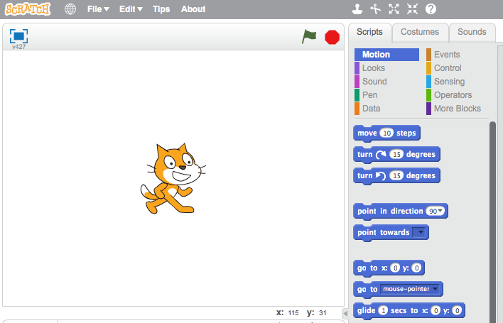
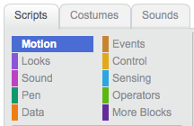

# Introduction { .intro }

Introduce the project here. What will children be creating? What is the objective of the project?

You can also add an embedded version of the final project, so that children can see what they are working towards. Don't worry, children won't be able to see your code!

<div class="scratch-preview">
  <iframe allowtransparency="true" width="485" height="402" src="https://scratch.mit.edu/projects/embed/32722912/?autostart=true" frameborder="0"></iframe>
  
</div>

# Step 1: Step name goes here { .activity }

Briefly explain the outcome of this step.

## Activity Checklist { .check }

+ The steps should be broken down into a number of checkpoints. You can add text in __bold__ or _italics_ to add emphasis to key words or important points.

+ Each checkpoint should clearly explain what the child needs to do.

+ To aid clarity, you can also include images, like this:

	

+ You should also regularly remind children to save their project:

## Save your project { .save }

# Step 2: Adding Scratch blocks { .activity }

This step shows how to add Scratch code to your project.

## Activity Checklist { .check }

+ You can add Scratch code to your project like this:

	```blocks
		when flag clicked
		point in direction (120 v)
		set pen color to [#FF0000]
		pen down
		forever
			move (1) steps
			if on edge, bounce
		end
	```

	You can [test](http://scratchblocks.codeclub.org.uk) your Scratch code, and there is a [guide](http://wiki.scratch.mit.edu/wiki/Block_Plugin/Syntax) to adding Scratch blocks to your project notes.

+ You can also colour-code your text, to match the colour of Scratch blocks.

	

	You can add:

	+ `Motion` {.blockmotion} blocks, for example `move (10) steps` {.blockmotion} or `if on edge, bounce` {.blockmotion};
	+ `Event` {.blockevents} blocks, for example `when flag clicked` {.blockevents} or `when I receive [message v]` {.blockevents};
	+ `Looks` {.blocklooks} blocks, for example `show` {.blocklooks} or `next costume` {.blocklooks}
	+ `Control` {.blockcontrol} blocks, for example `forever` {.blockcontrol}, or `wait (1) secs` {.blockcontrol};
	+ `Sound` {.blocksound} blocks, for example `play sound meow` {.blocksound} or `stop all sounds` {.blocksound};
	+ `Sensing` {.blocksensing} blocks, for example `key space pressed` {.blocksensing} or `ask ... and wait` {.blocksensing};
	+ `Pen` {.blockpen} blocks, for example `pen down` {.blockpen} or `clear` {.blockpen};
	+ `Operator` {.blockoperators} blocks, for example `pick random 1 to 10` {.blockoperators} or `10 * 2` {.blockoperators};
	+ `Data` {.blockdata} blocks for variables and lists, for example `score` {.blockdata} or `change score by 1` {.blockdata};
	+ `More` {.blockmoreblocks} blocks, for example `my function` {.blockmoreblocks}.

## Test your project { .flag }
You should regularly ask children to test their project, so that they can see the effects of the code they're creating. You can even use these points as opportunities to fix bugs and improve code.

## Save your project { .save }

## Challenge: Challenge name {.challenge}
You should add at least 1 challenge, to allow children to apply what they've during the project. You can ask children to fix a problem or improve or adapt their project in some way. 
