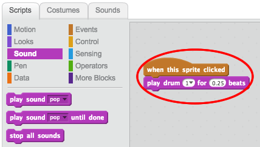
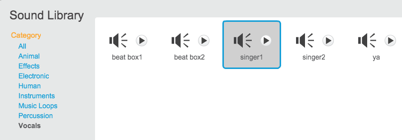

# Introduction { .intro }

In this project you'll learn how to code your own musical instruments!

<div class="scratch-preview">
  <iframe allowtransparency="true" width="485" height="402" src="https://scratch.mit.edu/projects/embed/26741186/?autostart=false" frameborder="0"></iframe>
  
</div>

# Step 1: Sprites { .activity }

Before you can start animating, you'll need to add in a 'thing' to animate. In Scratch, these 'things' are called __sprites__. 

## Activity Checklist { .check }

+ First, open up the Scratch editor. You can find the online Scratch editor at <a href="http://jumpto.cc/scratch-new">jumpto.cc/scratch-new</a>. It looks like this:

	

+ The cat sprite that you can see is the Scratch mascot. Let's get rid of it, by right-clicking and then clicking 'delete'.

	

+ Next, click 'Choose sprite from library' to open up a list of all the Scratch sprites.

	

+ Scroll down until you see a drum sprite. Click on a drum, and click 'OK' to add it to your project.

	

+ Click the 'shrink' icon, and then click on the drum a few times to make it smaller.

	

## Save your project { .save }

Give your program a name, by typing one into the text box in the top-left corner.

You can then click 'File' and then 'Save now' to save your project.


(If you don't have a Scratch account, you can save a copy of your project by clicking 'Download to your computer' instead).

# Step 2: The Stage { .activity }

The __stage__ is the area on the left, and is where your project comes to life. Think of it as a performance area, just like a real stage!

## Activity Checklist { .check }

+ At the moment, the stage is white, and looks pretty boring! Let's add a backdrop to the stage, by clicking 'Choose backdrop from library'.

	

+ Click 'Indoors' on the left, and then click on a stage backdrop and click 'OK'.

	

+ Your stage should now look like this:

	

# Step 3: Making a Drum { .activity }

Let's code your drum to make a sound when it's hit.

## Activity Checklist { .check }

+ You can find the code blocks in the 'Scripts' tab, and they are all colour-coded! 

	Click on the drum sprite, and then drag these 2 blocks into the code area to the right, making sure that they are connected together (like Lego blocks):

	

+ Click the drum to try out your new instrument!

+ You can also change how the drum looks when it's clicked, by creating a new costume. Click the 'Costumes' tab, and you'll see the drum image.

	

+ Right-click on the costume and click 'duplicate' to create a copy of the costume.

	

+ Click on the new costume (called 'drum2') and then select the line tool and draw lines to make it look like the drum is making a sound.

	

+ The names of the costumes aren't very helpful at the moment. Rename the 2 costumes to 'not hit' and 'hit' by typing the new name of each costume into the text box.

	

+ Now that you have 2 different costumes for your drum, you can choose which costume is displayed! Add these 2 blocks to your drum:

	

	The code block for changing the costume is in the `Looks` {.blocklooks} section.

+ Test your drum. When clicked, your drum should now look like it's been hit!

## Save your project { .save }

##Challenge: Improving your drum { .challenge }

+ Can you change the sound that the drum makes when it's clicked?


+ Can you also get the drum to make a sound when the spacebar is pressed? You'll need to use this `event` {.blockevents} block:

```blocks
	when [space v] key pressed
```

You can copy your existing code by right-clicking on it and clicking 'duplicate'.


## Save your project { .save }

# Step 4: Making a Singer { .activity .new-page }

Let's add a singer to your band!

## Activity Checklist { .check }

+ Add another 2 sprites to your stage; a singer and a microphone.

	

+ Before you can make your singer sing, you need to add a sound to your sprite. Make sure that you have selected your singer, then click the 'Sounds' tab, and click 'Choose sound from library':

	

+ If you click 'Vocals' on the left hand side, you will then be able to choose a suitable sound to add to your sprite.

	

+ Now that the sound has been added, you can add this code to your singer:

	```blocks
		when this sprite clicked
		play sound [singer1 v] until done
	```

+ Click on your singer, to make sure that she sings when clicked.

## Save your project { .save }

##Challenge: Changing your singer's costume { .challenge }
Can you make your singer look like she is singing when clicked? If you need help, you can use the instructions for creating a drum above.


Remember to test that your new code works!

## Save your project { .save }

##Challenge: Make your own band { .challenge }
Use what you've learnt in this project to make your own band! You can create any instruments you like, but look at the available sounds and instruments to get some ideas.


Your instruments don't have to be sensible though. For example, you could make a piano made out of muffins!


As well as using existing sprites, you can also draw your own.


If you have a microphone you can record your own sounds, or even use a webcam to hit your instruments!


## Save your project { .save }
