# Introduction { .intro }

You are going to learn how to create your own sprint game, in which you have to use the left and right arrow keys to get to the finish line as quickly as you can.

  <iframe allowtransparency="true" width="485" height="402" src="https://scratch.mit.edu/projects/embed/85609372/?autostart=false" frameborder="0"></iframe>
  

# Step 1: On your marks... { .activity }

Let's start by creating a race countdown.

## Activity Checklist { .check }

+ Open the 'Sprint' Scratch project. Your club leader will give you a copy of this project, or you can open it online at <a href="http://jumpto.cc/sprint-resources" target="_blank">jumpto.cc/sprint-resources</a>.

+ To start with, let's put the finish line on the horizon:

	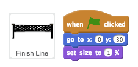

+ If you click the flag to test your code, you'll see your finish line in the distance.

	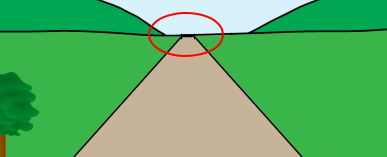

+ Next, use `say` {.blocklooks} blocks to create a countdown, and then broadcast a `start` {.blockevents} message.

	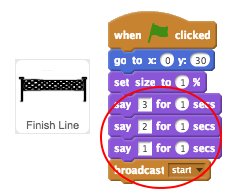	

+ You can also add sounds to your countdown.

	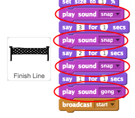	

## Save your project { .save }

# Step 2: Going the distance { .activity }

Let's move the finish line when the arrow keys are pressed.

## Activity Checklist { .check }

+ You want to allow the player to press the arrow keys __until they have run 100 meters__. To do this, create a new variable called `distance` {.blockdata}.

	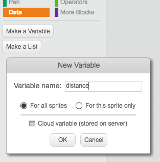

+ You should see your new variable on the stage. Right-click the variable and select 'large readout'.

	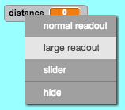

+ Drag your variable to the bottom of the stage.

	

+ Set the `distance` {.blockdata} to 0 when the flag is clicked.

	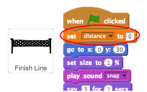

+ Once your race starts, your player should sprint __until they have run 100 meters__.

	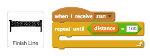

+ Add code so that your finish line gets a little bigger after the player presses the left arrow key. The distance should also increase.

	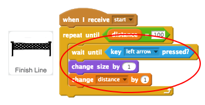

+ Click the green flag to test your project. You should see that the finish line gets bigger when the left arrow is pressed, but doesn't move towards you.

	

+ To fix this, you can add code to move the finish line down slightly each time a key is pressed.

	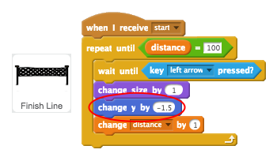

+ Test your project again and you shoud see the finish line move down the stage towards you.

	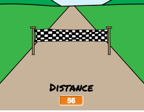

+ You should then do the same for the right arrow key.

	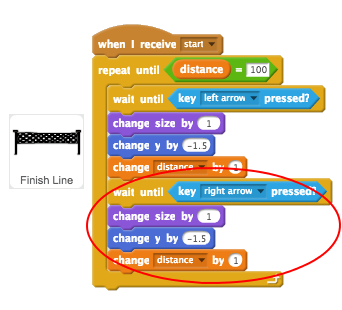

+ If you click to see the finish line's costumes, you should see that there are 2.

	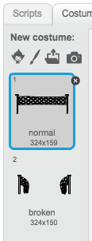

+ You can switch to the 'broken' costume (and end the game) at the end of the race. Remember to switch to the 'normal' costume at the start of the race!

	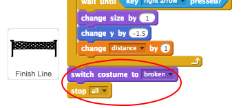

+ If you want to play a sound at the end, you'll have change your `stop all` {.blockcontrol} block to `stop other scripts in sprite` {.blockcontrol}.

	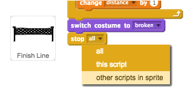

	This means that the timer you'll create will stop counting, but the sound will still play.

	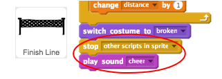

+ Have you noticed that you can cheat your game by just holding down the left and right arrow keys?

	To fix this, you need to make sure that each key is pressed __and then released__ before moving the finish line.

	Here's the code you'll need to add:

	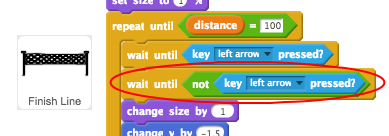

	You'll need to do the same for the right arrow key.

## Save your project { .save }

# Step 3: Who is the fastest? { .activity }

Let's add a timer to your game, to see who can sprint the fastest.

## Activity Checklist { .check }

+ Create a new `time` {.blockdata} variable, and move it to the center of your stage.

	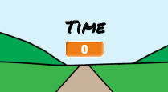

+ Set the time to 0 at the start of your game.

	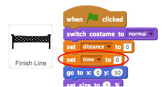

+ Add this code to make your timer count up when the game starts.

	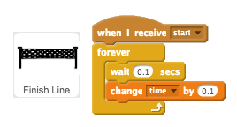

+ Test your project by clicking the green flag. You should see your timer counts up until you've sprinted 100 meters.

	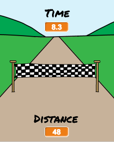

## Save your project { .save }

# Step 4: Adding scenery { .activity }

Let's code a tree to move as the player sprints.

## Activity Checklist { .check }

+ First, position the tree and make it small when the flag is clicked.

	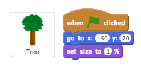

+ Once the race starts, the tree should move until the player has sprinted 100 meters.

	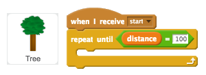

+ Once the left key has been pressed (and released), the tree should get bigger and move - just like the finish line.

	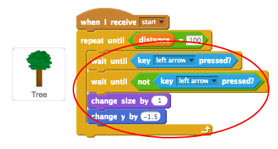

+ If you test your tree, you'll see that it moves downwards, onto the track.

	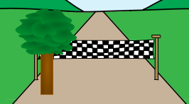

+ To fix this, add code to make your tree move away from the track slightly.

	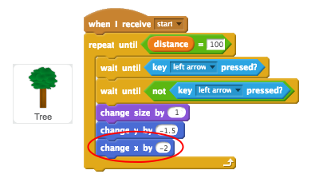

+ You should also do the same for the right arrow key. Here's how your Tree's code should look:

	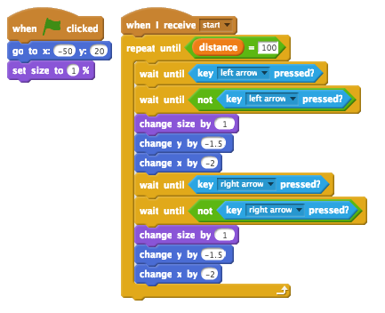

## Save your project { .save }

## Challenge: Add a spectator {.challenge}
Can you add a spectator to your race?

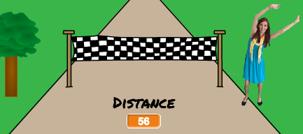

Remember that the code you'll need is very similar to the code you've already added to your finish line and your tree.

Here are some useful code blocks to help you:

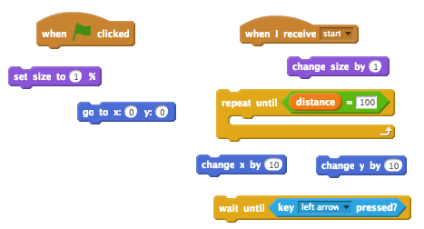

If you prefer, you can add another tree instead, or anything else you like!

## Save your project { .save }
