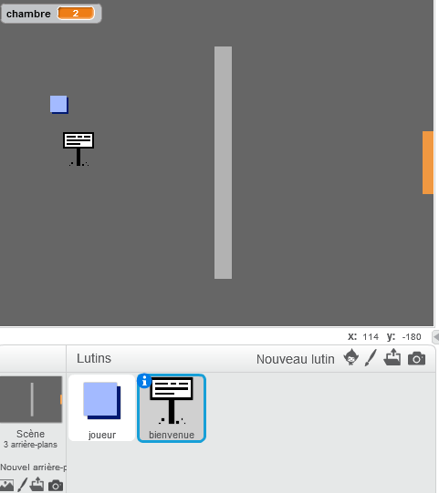
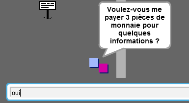
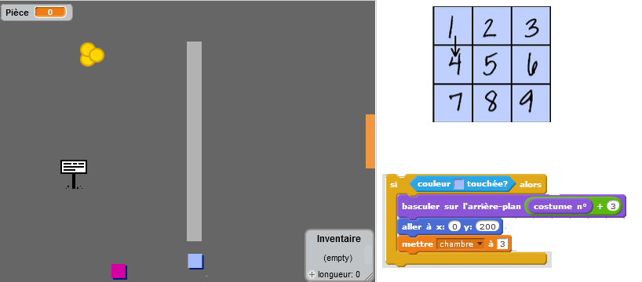

---

title : Creat Your Own World
level: Scratch 2
language: fr-FR
stylesheet: scratch
embeds: "*.png"
materials: ["Club Leader Resources/*.*","Project Resources/*.*"]
...

# Introduction { .intro }

Dans ce projet vous apprendrez à créer votre propre jeu d'aventure à monde ouvert.

<div class="scratch-preview">
	<iframe allowtransparency="true" width="485" height="402" src="http://scratch.mit.edu/projects/embed/34248822/?autostart=false" frameborder="0"></iframe>
	
</div>

# Etape 1 : Codage de votre joueur { .activity }

Commençons en créant un acteur(joueur) qui peut se déplacer dans votre monde.

## liste de contrôle d'activité  { .check }

+ Commencez un nouveau projet scratch et supprimez le lutin de chat pour que votre projet soit vide. Vous pouvez trouver l'éditeur de scratch en ligne à <a href="http://jumpto.cc/scratch-new">jumpto.cc/scratch-new</a>.

+ Pour ce projet, vous devriez avoir un dossier de 'Ressources du Projet', contenant toutes les images dont vous aurez besoin. Assurez-vous que vous pouvez trouver ce dossier et demander à votre leader de club si vous ne trouvez pas cela.

	

+ Ajoutez l'image 'room1.png' comme un nouveau fond de scène et l'image 'player.png' comme un nouveau lutin. Si vous n'avez pas ces images vous pouvez les dessiner vous-même! Voici à quoi votre projet devrait ressembler :

	

+ Utilisons les touches de direction pour déplacer le joueur. Quand le joueur appuie sur la flèche haut, vous voulez que le joueur avance, en changeant sa coordonnée d'y. Ajoutez ce code au lutin de joueur :

	```blocks
		quand le drapeau pressé
		répéter indéfiniment
			Si <touche [up arrow v] pressée? > alors
				ajouter (2) à y
			end
		end
	```

+ Testez votre joueur en cliquant du drapeau et ensuite le maintien en haut la flèche. Votre joueur avance-t-il ?

	

+ Pour déplacer le joueur à gauche, vous devez ajouter un autre 'si' {.blockcontrol} à votre joueur, qui change la coordonnée de x :

	```blocks
		quand le drapeau pressé
		répéter indéfiniment
			Si <touche [up arrow v] pressé? > alors
				ajouter (2) à y
			end
			Si <touche [left arrow v] pressé? > alors
				ajouter (-2) à x
			end
		end
	```

## Défi : Déplacement dans toutes les quatre directions {.challenge}
Pouvez vous ajouter plus de code à votre joueur, pour qu'ils puissent avancer, en bas, gauche et droit. Utilisez le code ci-dessus pour vous aider!

## Sauvegarder votre projet { .save }

+ Testez votre joueur de nouveau et vous verrez qu'ils font la capacité de traverser les murs gris clair.

	

+ Pour le réparer, vous devez déplacer le joueur, mais les déplacer ensuite en arrière s'ils touchent un mur gris clair. Voici le code dont vous aurez besoin:

	```blocks
		quand le drapeau pressé
		répéter indéfiniment
			Si <touche [up arrow v] pressé? > alors
				ajouter (2) à y
				Si < couleur [#BABABA] touchée? > alors
					ajouter (-2) à y
				end
			end
		end
	```

	Remarquez que le nouveau 'si' {.blockcontrol}` couleur touchée ` {.blocksensing} est à l'intérieur `si`{.blockcontrol}`Touche [en haut flèche]`{.blocksensing}.

+ Testez ce nouveau code en vous déplaçant au-dessous du mur - vous ne devriez pas pouvoir avancer.
	
	

+ Faisons le même pour la flèche gauche, reculer si le joueur touche un mur. C'est comme-ci que devrait être votre code de joueur:

	

## Défi : Réparation du mouvement de votre joueur {.challenge}
Ajoutez le code à votre joueur pour que vous ne puissiez traverser les murs dans aucune direction. Utilisez le code ci-dessus pour vous aider!

## Sauvegarder votre projet { .save }

# Etape 2 : Codage de votre monde { .activity }

Permettons à au joueur de marcher par des portes pour aller dans d'autres pièces!

## Liste de contrôle d'activité { .check }

+ Ajoutez encore 2 fonds à votre scène ('room2.png' et 'room3.png'), pour que vous ayez 3 fonds. Assurez-vous qu'ils sont dans l'ordre ceci vous aidera plus tard.

	

+ Vous aurez besoin d'une nouvelle variable appelée 'room' {.blockdata}, Garder la trace de la chambre ou est présent le joueur.

	

+ Quand le joueur touche la porte orange dans la première chambre, le fond suivant devrait être affiché et le joueur devrait retourner au côté gauche de la scène. Voici le code dont vous aurez besoin - il devrait aller à l'intérieur du lutin joueur 'répeter indéfiniment' {.blockcontrol}:

	```blocks
		Si < couleur [#F2A24A] touchée > alors
			basculer sur l'arrière-plan [next backdrop v]
			aller à x: (-200) y: (0)
			ajouter [room v] à (1)
		end
	```

+ Ajoutez ce code au début de votre code de joueur avant `répeter indéfiniment` {.blockcontrol} pour s'assurer que tout est remis quand le drapeau est cliqué :

	```blocks
		mettre [room v] à (1)
		aller à x: (-200) y: (0)
		basculer sur l'arrière-plan [room1 v]
	```

+ Cliquez sur le drapeau et déplacez votre joueur sur la porte orange. Votre joueur se déplace-t-il vers l'écran suivant ? Fait Mettre 'room'{.blockdata} à 2 ?

	

## Défi : Déplacement vers la chambre précédente {.challenge}
Pouvez-vous faire votre joueur vous déplacer vers la chambre précédente quand ils touchent une porte jaune ? Rappelez-vous que ce code sera très ressemblant au code vous avez déjà ajouté pour vous déplacer vers la chambre suivante.

## Sauvegarder votre projet { .save }

# Etape 3 : Indices { .activity }

Ajoutons des indices à votre monde, guider votre joueur sur son voyage.

## Liste de contrôle d'activité { .check }

+ Téléchargez l'image 'sign.png' comme un nouveau lutin et rebaptisez le 'welcome sign’'.

	

+ Ce signe sera seulement visible dans la chambre 1, donc ajoutons un certain code au signe pour nous assurer que ceci arrive :

	```blocks
		quand le drapeau pressé
		répéter indéfiniment
			Si < (room) = [1] > alors
				montrer
			sinon
				cacher
			end
		end
	```

+ Testez votre signe en vous déplaçant entre des pièces. Votre signe devrait seulement être visible dans la pièce 1.

	

+ Un indice n'aide pas beaucoup s'il ne dit rien! Ajoutons un peu plus de code (dans un autre bloc séparé) pour afficher un message si le signe est touché :

	```blocks
		quand le drapeau pressé
		répéter indéfiniment
			Si < touché [player v]? > alors
				dire [Welcome! Can you get to the treasure?]
			else
				dire []
			end
		end
	```
+ Testez votre signe, vous devriez voir un message quand le joueur le touche.

	

## Sauvegarder votre projet { .save }

## Défi : Trésor! {.challenge}
Pouvez-vous ajouter un nouveau lutin de trésor, en utilisant l'image 'chest.png'. Ce coffre au trésor devrait être placé dans la pièce 3 et devrait dire 'Bravo !' quand le joueur le touche.


## Sauvegarder votre projet { .save }

# Etape 4 : le Peuple { .activity }

Ajoutons des autres personnes à votre monde avec lequel votre joueur peut interagir.

## Liste de contrôle d'activité { .check }

+ Ajoutez un nouveay lutin, utilisant l'image 'person.png'.

	

+ Ajoutez ce code, pour que la personne parle à votre joueur. Ce code est très ressemblant au code que vous avez ajouté à votre panneau :

	```blocks
		quand le drapeau pressé
		aller à x: (-200) y: (0)
		répeter indéfiniment
			Si < touché [player v]? > alors
				dire [Did you know that you can go through orange and yellow doors?]
			else
				dire []
			end
		end
	```

+ Vous pourriez aussi permettre à votre personne de se déplacer, en utilisant ces deux blocs :

	```blocks
		avancer de (1) 
		rebondir si le bord est atteint
	```

	Votre personne agira différemment, selon si vous placez ce code à l'intérieur du `répéter indéfiniment` {.blockcontrol} ou du `si` {.blockcontrol}. Essayez les deux et voyez ce que vous préférez.

	

+ Remarquez vous que la personne donne un coup à l'envers. Pour arrêter ceci, cliquez sur l'icône d'information sur le lutin(`i`{.blockmotion}), et cliquez sur le point pour fixer un style de rotation.

	

## Défi : Amélioration de votre personne {.challenge}
Pouvez-vous ajouter le code à votre nouvelle personne, pour qu'ils apparaissent seulement dans la chambre 1 ? Assurez-vous de tester votre nouveau code!

## Sauvegarder votre projet { .save }

+ Vous pouvez aussi ajouter des ennemis de patrouille, qui termine le jeu si le joueur les touchent. Ajoutez un nouveau lutin ennemi et changez le style de rotation, comme vous a fait avec le lutin 'personne'.

+ Ajoutez le code à votre ennemi, pour qu'ils apparaissent seulement dans la chambre 2.

+ Vous devrez aussi ajouter le code pour déplacer l'ennemi et terminer le jeu si l'ennemi touche le joueur. Il est plus facile de faire ceci dans des blocs de code séparés. Voici comment votre code ennemi devrait être :

	

+ Testez votre ennemi, assurez vous que :
	 + il est seulement visible dans la chambre 2;
	 + Il patrouille dans la pièce;
	 + le jeu se termine si le joueur le touche.

## Sauvegarder votre projet { .save }

## Défi : Plus d'ennemis {.challenge}
Pouvez-vous créer un autre ennemi dans la chambre 3, qui patrouille en haut et en bas entre les murs?


## Sauvegarder votre projet { .save }

# Etape 5 : pièces de monnaie { .activity }

## Liste de contrôle d'activité  { .check }

+ Ajoutez une nouvelle variable 'pièces' {.blockdata} à votre projet.

+ Ajoutez un nouveau lutin 'coins' à votre projet.


+ Ajoutez le code à vos pièces de monnaie, pour qu'ils apparaissent seulement dans la chambre 1.

+ Ajoutez le code à votre lutin de pièce, ajouter 1 à vos 'pièces' {.blockdata} une fois que vous l'avez ramassé :

	```blocks
		quand le drapeau pressé
		attendre jusqu'à  <touché [player v]?>
		mettre [coins v] à (3)
		stop [other scripts in sprite v]
		cacher
	```

	Le code `stop autre scripts du lutin` {.blockcontrol} est nécessaire pour que la pièce de monnaie s'arrêtent d'être affiché dans la chambre 1 une fois qu'elle a été ramassé.

+ Vous devrez aussi ajouter le code pour mettre votre `pièces` {.blockdata} à 0 au début de votre jeu.

+ Testez votre projet, rassembler la pièce de monnaie devrait changer votre score à 1

## Défi : Plus de pièces de monnaie {.challenge}
Pouvez-vous ajouter plus de pièces de monnaie à votre jeu ? Ils peuvent être dans des chambres différentes et quelques pièces de monnaie pourraient même être gardées par des gardes.

# Etape 6 : Portes et clés { .activity }

## Liste d'activite de contrôle { .check }

+ Créez un nouvel lutin de vos image 'clé-blue.png'. Changez de votre scène au fond 3 et placez la clé a un endroit difficile a prendre!

 	

+ Assurez-vous que votre clé est seulement visible dans la chambre 3.

+ Créez une nouvelle variable de liste appelée 'stock' {.blockdata}. Ceci servira à stocker tous les articles que votre joueur rassemble.

+ Le code pour rassembler la clé est très semblable au code pour rassembler des pièces de monnaie. La différence est que vous ajoutez la clé à votre stock.

	```blocks
		quand le drapeau pressé
		attendre jusqu'à <touché [player v]?>
		ajouter [blue key] à [stock v]
		stop [other scripts in sprite v]
		cacher
	```

+ Testez votre clé, voir si vous pouvez la ramasser et l'ajouter à votre stock. Rappelez-vous d'ajouter le code à votre scène pour vider votre stock au début.

	```blocks
		supprimer l'élément (all v) de la liste [stock v]
	```

+ Créez un nouveau lutin de vos image ' porte-blue.png' et placez votre porte bleue à travers l'écart dans les deux murs.

	

+ Ajoutez le code à votre porte, pour que ce soit seulement visible dans la pièce 3.

+ Vous devrez cacher votre porte bleue pour permettre à votre joueur de passer une fois que vous avez la clé bleue dans votre stock.

	```blocks
		quand le drapeau pressé
		attendre jusqu'à  <[stock v] contient [touche bleue]>
		stop [autre scripts du lutin v]
		cacher
	```

+ Testez votre projet et voyez si vous pouvez ramasser la clé bleue pour ouvrir la porte!

## Sauvegarder votre projet { .save }

## Défi : Créez votre propre monde {.challenge}
Vous pouvez maintenant continuer à créer votre propre monde. Voici quelques idées :

+ Changez l'arrangement de votre jeu et vos graphisme de jeu;
+ Ajouter le son et la musique à votre jeu;
+ Ajouter plus de personnes, ennemis, des panneaux et des pièces de monnaie;
+ Ajouter des portes rouges et jaunes, qui ont besoin de leurs propres clés pour les ouvrir;
+ Ajouter plus de chambres à votre monde;
+ Ajouter d'autres articles utiles à votre jeu;

+ Utiliser l'argent pour obtenir des informations a d'autres personnes;

	

+ Vous pourriez même ajouter des portes du Nord et du sud, pour que le joueur puisse se déplacer entre des chambres dans les 4 directions.

	

## Sauvegarder votre projet { .save }