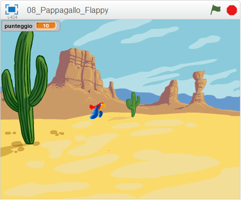
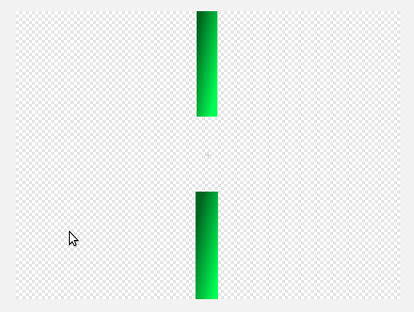

# Introduzione { .intro}

In questo progetto creaiamo la nostra versione del famosissimo gioco per mobile chiamato Flappy Bird. Questo progetto necessita di Scratch 2.0.

Premi la barra spaziatrice per far sbattere le ali al pappagallo Flappy e farlo volare attraverso gli i tubi tagliati!



<div class="pagebreak"> </div>

# **Passo 1:** Fai cadere Flappy {.activity}

## Lista delle Attivita'{ .check}

+ Crea un nuovo progetto Scratch. Rimuovi il gatto Felix con click-destro e seleziona **cancella**.
+ Sostituisci lo sfondo con lo sfondo **desert** presente nella categoria **Natura** della libreria di Scratch
+ Aggiungi il pappagalli Flappy. Devi aggiungere uno sprite con due costumi. Uno per ali-su ed uno per ali-giu. Lo sprite **Parrot** nella categoria **Animali** della libreria di Scratch va benissimo
+ Cambia il nome dello sprite in __flappy__
+ Crea un nuovo script per flappy:
```blocks
	quando si clicca su @
	vai a x: (-50) y: (0)
	per sempre
		cambia y di (-3)
```

## Verifica il progetto { .flag}

__Fai click sulla bandierina verde__ 
+ Flappy inizia a volare al centro dello schermo e poi cade giu'?

## Salva il progetto { .save}

<div class="pagebreak"> </div>

# **Passo 2:** Fai volare Flappy {.activity}

Vogliamo che flappy voli in alto quando premi la barra spaziatrice

## Lista delle Attivita'{ .check}

+ Fai click sul tab __Costumi__ e chiama i costumi con **ali-su** e **ali-giu**.
+ Adesso torna al tab __Script__ ed aggiungi questo script: 
```blocks
	quando si preme il tasto [spazio v]
	passa al costume [ali-giu v]
	ripeti (10) volte
		cambia y di (6)
	fine
	passa al costume [ali-giu v]
	ripeti (10) volte
		cambia y di (6)
	fine
```

## Verifica il progetto { .flag}

__Fai click sulla bandierina verde__ 
+ Riesci a controllare flappy con la barra spaziatrice? 
+ Noti che qualche volta premi spazio ma flappy non si muove? 
Ok risolveremo questo problema dopo...

## Salva il progetto { .save}

<div class="pagebreak"> </div>

# **Passo 3:** Aggiusta i controlli {.activity}

 Ci piacerebbe che flappy rispondesse ai nostri comandi ogni volta che premiamo spazio. Quando premiamo spazio flappy inizia due cicli di movimento. Se premiamo spazio dinuovo prima che i loop siano finiti Scratch ignora la seconda pressione del tasto spazio. Per risolvere questo problema dobbiamo usare una variabile che conta il numero di battiti di ali necessari.

## Lista delle Attivita'{ .check}

+ Stacca il blocco sotto `quando si preme il tasto [spazio v]` {.blockbrown} e mettilo di lato. Lo useremo dopo
+ Crea una nuova variabile solo per flappy e chiamala `ali` {.blockorange}.
+ Aggiungi questo script trascinando il blocco che avevi messo di lato
```blocks
	quando si preme il tasto [spazio v]
	porta [ali v] a [0]
	passa al costume [ali-su v]
	per sempre
		ripeti fino a quando <(ali) = [0]>
			cambia [ali v] di (-1)
			passa al costume [ali-giu v]	
			ripeti (10) volte
				cambia y di (6)
			fine
			passa al costume [ali-su v]
			ripeti (10) volte
				cambia y di (6)
			fine
```
+ Infine aggiungi al blocco `quando si preme il tasto [spazio v]` {.blockbrown}:
```blocks
    quando si preme il tasto [spazio v]
        cambia [ali v] di (1)
```

## Verifica il progetto { .flag}

__Fai click sulla bandierina verde__ 
+ Adesso flappy sbatte le ali ogni volta che premi spazio?


# **Passo 4:** Aggiungiamo le tubature {.activity}

Adesso aggiungiamo degli ostacoli che Flappy deve evitare

## Lista delle Attivita'{ .check}

+ Fai click su `Disegna un nuovo sprite`{.blockgrey} 
+ Chiama il tuo costume con **tubo**
+ Se il costume e' in `modalita' Bitmap` {.blockgrey} fai click sul pulsante `Converti in vettoriale` {.blockgrey}
+ Fai click su `Zoom -` {.blockgrey} cosi' da vedere tutta l'area di disegno
+ Fai click sullo strumento `Rettangolo` {.blockgrey}, seleziona un colore e fai click sul `Rettangolo pieno` {.blockgrey} (in basso a sinistra)
+ Fai click e crea due rettangoli, uno dall'alto verso il basso ed un altro dal basso verso l'alto, come visualizzato in figura:



+ Puoi sfumare il colore dei rettangoli facendo click sullo strumento  `Riempi con il colore`{.blockgrey} e poi facendo click su `Gradiente orizontale` {.blockgrey}. Scegli due tonalita' dello stesso colore per la sfumatura. Adesso fai click all'interno di ciscun rettangolo e vedrai che verra' colorato con una sfumatura dei due colori da te scelti.
+ Chiama il tuo sprite **tubo**

## Salva il progetto { .save}

# **Passo 5:** Facciamo muovere le tubature {.activity}

Adesso facciamo muovere le tubature in modo casuale in modo da ostacolare il volo di Flappy.

## Lista delle Attivita'{ .check}

+ Fai click sullo sprite **tubo*** e seleziona il tab `Scripts` {.blockgrey}.
+ Aggiungi questi script:
```blocks
	quando si clicca su @
	nasconditi
	porta dimensione al (200)%
	per sempre
		crea clone di [me stesso v]
		attendi (2) secondi

	quando vengo clonato
	vai a x:(240)  y: (numero a caso tra (-80) e (80))
	ripeti (120) volte
		cambia x di (-4)
	fine
	elimina questo clone
```

## Verifica il progetto { .flag}

__Fai click sulla bandierina verde__ 
+ Vedi le tubature apparire a con una fessura a diverse altezze?  
Se e' troppo difficile far volare Flappy tra le tubature, puoi rendere la fessura tra i tubi piu' ampia. Devi editare nuovamente il costume del tubo.

## Salva il progetto { .save}

# **Passo 6:** Accorgersi delle collisioni con le tubature {.activity}

Per rendere il gioco coinvolgente, il giocatore deve far volare Flappy attraverso le fessure nei tubi senza toccarli mai. Adesso aggiungiamo alcuni blocchi per capire quando Flappy urta qualcosa 

## Lista delle Attivita'{ .check}

+ Aggiungiamo un effetto sonoro per quando Flappy urta i tubi. Fai click sullo sprite **flappy** e poi sul tab `Suoni`{.blockgrey}
+ `Scegli un suono dalla libreria` {.blockgrey} e seleziona **screech** dalla categoria **Elettronica**
+ Adesso torna sullo script per Flappy
+ Aggiungi questo script:
```blocks

	quando si clicca su @
	attendi fino a quando ((sta toccando [bordo v]) o (sta toccando [tubo v]))
	produci suono [screech v]
	dire [Game Over! v]
	invia a tutti [GameOver v]
	arresta [tutti gli altri script dello sprite]
```

+ Fai click sullo script del **tubo** ed aggiungi:
```blocks
	quando ricevo [GameOver v]
	arresta [tutti gli altri script dello sprite]
```

## Verifica il progetto { .flag}

__Fai click sulla bandierina verde__ 
+ Il gioco finisce quando Flappy urta un tubo o il bordo dello schermo?

## Salva il progetto { .save}

# **Passo 7:** Aggiungi il punteggio {.activity}

Il giocatore fa' un punto ogni volta che riesce a far volare Flappy attraverso una tubatura 

## Lista delle Attivita'{ .check}

+ Aggiungiamo un effetto sonoro per quando Flappy fa' un punto. Fai click sullo sprite **tubo** ed aggiungi un suono dalla libreria. Scegli **bird** dalla categoria **Animali**
+ Torna sullo script di tubo
+ Crea una nuova variabile `per tutti gli sprite` {.blockgrey} e chiamala `punteggio` {.blockorange}.
+ Aggiungi un blocco per impostare il punteggio a 0 quando il gioco inizia
+ Aggiungi il blocco seguente:
```blocks
 quando vengo clonato
    attendi fino a quando ((posizione x) < ([posizione x v] di [flappy v]))
    cambia [punteggio v] di (1)
    produci suono (bird)```

## Verifica il progetto { .flag}

__Fai click sulla bandierina verde__ 
+ Il punteggio viene incrementato quando Flappy passa attraverso una tubatura? 

## Salva il progetto { .save}

Ben fatto!! Hai finito il gioco base. Ci sono altre cose che puoi fare cin il tuo gioco. Dai un'occhiata alle sfide!

## Sfida 1: Aggiungi un record { .challenge}

+ Crea una nuova variabile e seleziona `Cloud variable (stored on server)` {.blockgrey}. Chiamala `record`  {.blockorange}
+ Quando il gioco e' finito controlla se devi registrare un nuovo record:
```blocks
	quando ricevo [GameOver v]
	se <(punteggio) > (record)> allora
		porta [record v] a (punteggio)
	fine
	arresta [tutti gli altri script dello sprite]	
```

## Verifica il progetto { .flag}

__Fai click sulla bandierina verde__ 
+ Il record viene aggiornato correttamente?

## Salva il progetto { .save}

## Sfida 2: Aggiungi l'effetto gravita' { .challenge}

Quando qualcosa cade solitamente non lo fa' a velocita' costante. Per questa sfida faremo cadere Flappy con un'accelerazione di gravita'.

+ Aggiungi una nuova variabile solo per lo sprite flappy e chiamala `gravita'` {.blockorange}.
+ Cambia lo script per flappy in questo modo:
```blocks
	quando si clicca su @
	porta [gravita' v] a [0]
	vai a x: (-50) y: (0)
	per sempre
		cambia y di (gravita')
		cambia [gravita' v] di (-0.4)
```

+ Cambia lo script di volo in questo modo:
```blocks
	quando si preme il tasto [spazio v]
	porta [ali v] a [0]
	passa al costume [ali-su v]
	per sempre
		ripeti fino a quando <(ali) = [0]>
			cambia [ali v] di (-1)
			passa al costume [ali-giu v]	
			cambia [gravita' v] di (8)
			aspetta (0.2) secondi
			passa al costume [ali-su v]
			aspetta (0.2) secondi
```

## Verifica il progetto { .flag}

__Fai click sulla bandierina verde__ 
+ Adesso Flappy e' attratto verso il basso quando vola e cade?

## Salva il progetto { .save}

## Sfida 3: Flappy cade per terra { .challenge}

Quando il giocatore perde la partita Flappy cade a terra al fondo dello schermo

+ Sostituisci il blocco `invia a tutti GameOver` {.blockbrown} con `invia a tutti cado` {.blockbrown} 
+ Adesso aggiungi questo script:
```blocks
	quando ricevo [cado v]
	ruota in senso antiorario di (5) gradi

	quando ricevo [cado v]
	ripeti fino a quando <(posizione y) < [-180]>
		cambia y di [gravita' v]
		cambia [gravita' v] di (-0.4)
	fine
	nasconditi
	invia a tutti [GameOver v]
```

+ Non dimenticarti di aggiungere il blocco `mostrami` {.blockpurple} e di orientare Flappy nella giusta direzione quando il gioco inizia.

## Verifica il progetto { .flag}

__Fai click sulla bandierina verde__ 
+ Flappy cade per terra quando urta una tubatura? 
+ Flappy riappare nella corretta posizione ed orientamento quando il gioco riprende?

## Salva il progetto { .save}

Ben fatto!!! Hai finito con questo esercizio. Adesso divertiti con il tuo nuovo gioco!!!

Ehi, non dimenticare che puoi condividere il tuo gioco con tutti i tuoi amici e familiari. Basta che fai selezioni il menu File e poi **Share to website**!!