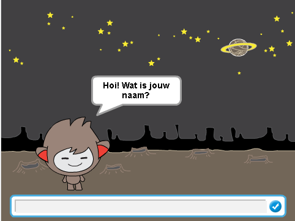
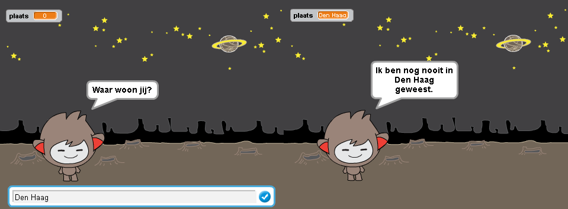
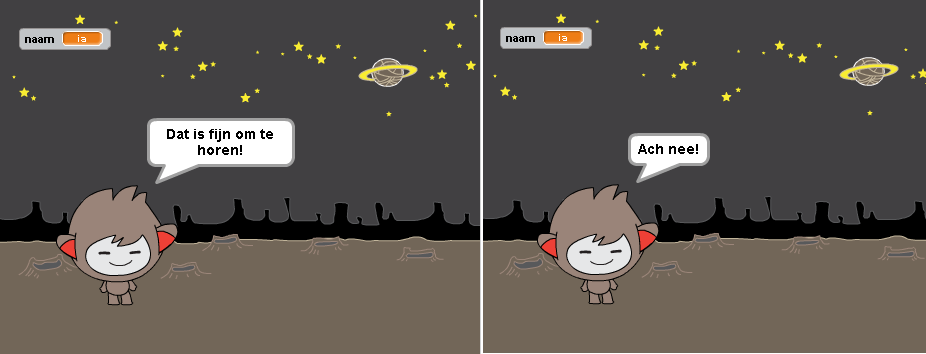
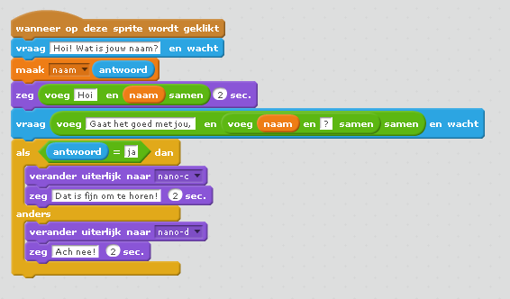
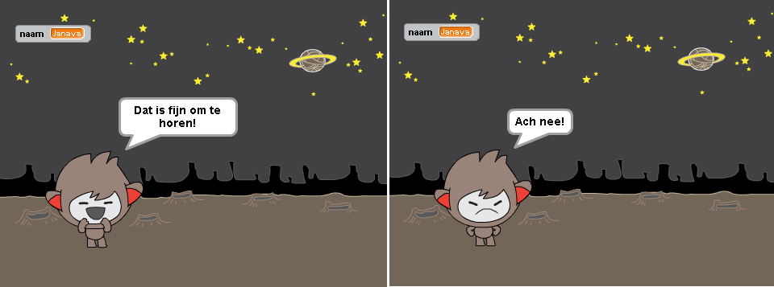
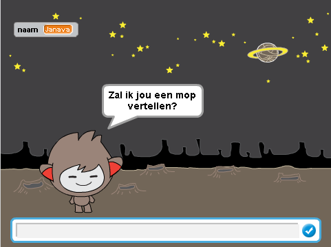
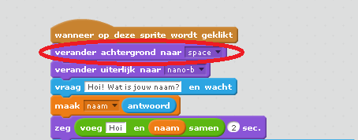
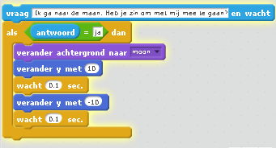

---
title: ChatBot
level: Scratch 1
language: nl-NL
stylesheet: scratch
embeds: "*.png"
materials: ["Club Leader Resources/*"]
...

# Introductie { .intro }

Dit keer ga je leren, hoe je een 'pratende robot' programmeert!

<div class="scratch-preview">
  <iframe allowtransparency="true" width="485" height="402" src="http://scratch.mit.edu/projects/embed/26762091/?autostart=false" frameborder="0"></iframe>
  
</div>

# Stap 1: Jouw pratende robot { .activity }

## Activiteiten Checklist { .check }

+ Voordat je jouw pratende robot gaat maken, moet je eerst zijn persoonlijkheid gaan bepalen.
	+ Wat wordt zijn naam?
	+ Waar verblijft hij?
	+ Is hij blij? Serieus? Grappig? Verlegen? Of vriendelijk?

+ Begin een nieuw Scratch project en verwijder de kat, zodat jouw project leeg is. Je kan de online Scratch editor vinden via <a href="http://jumpto.cc/scratch-new">jumpto.cc/scratch-new</a>.

+ Kies een van deze karakter afbeeldingen (sprite) en voeg deze toe aan jouw project:

	

+ Kies een achtergrond die past bij de persoonlijkheid van jouw pratende robot. Hier volgt een voorbeeld, maar die van jou mag er natuurlijk anders uitzien:

	

## Sla jouw project op { .save }

# Stap 2: Een pratende robot { .activity }

Nu jij een robot met een eigen persoonlijkheid hebt, gaan we hem programmmeren om met jou te praten.

## Activiteiten Checklist { .check }

+ Klik op jouw chatbot karakter en voeg het volgende programma toe:

	```blocks
		wanneer op deze sprite wordt geklikt
		vraag [Hoi! Wat is jouw naam?] en wacht
		zeg [Wat een mooie naam!] (2) sec.
	```

+ Klik op jouw robot om het uit te proberen. Nadat jou naar jouw naam gevraagd is, typ je jouw naam in op het invoergedeelte, onderaan het scherm.

	

+ Jouw robot antwoord iedere keer eenvoudig met `Wat een mooie naam!`. Je kan het antwoord van jouw robot persoonlijker maken door gebruik te maken van het antwoord van de speler. Verander het programma van de robot, zodat het er als volgt uitziet:

	```blocks
		wanneer op deze sprite wordt geklikt
		vraag [Hoi! Wat is jouw naam?] en wacht
		zeg <voeg [Hoi] en (antwoord) samen> (2) sec.
	```

	Om het laatste blok te maken, moet je eerst het groene `voeg ( ) en ( ) samen` {.blockoperators} blok binnen het `zeg` {.blocklooks} blok slepen.

	

	Je kan de tekst `hello` aanpassen om `Hoi` te zeggen, daarna sleep je het licht blauwe `antwoord` {.blocksensing} blok (vanuit de 'Waarnemen' selectie) over de tekst `world`.

	

+ Probeert dit nieuwe programma uit. Werkt het zoals je verwacht? Kan je de problemen oplossen die je ziet? (Hint: Je kan proberen ergens een spatie toe te voegen!)

+ Het kan zijn dat je het antwoord van de gebruiker als een variabele wilt bewaren, zodat je het later weer kan gebuiken. Maak een nieuwe variabele en noem deze `naam` {.blockdata}. Als je bent vergeten hoe dit moet, kan het 'Ghostbuster' project je verder helpen.

+ De informatie die je hebt ingevoerd is al opgeslagen als een speciale variabele genaamd `antwoord` {.blocksensing}. Ga naar de 'Waarnemen' groep van blokken en klik op het antwoord blok, zodat er een spreekballonnetje verschijnt. De huidige waarde van `antwoord` {.blocksensing} zou daarin te zien moeten zijn.

+ Als je de nieuwe variabele hebt gemaakt, zorg er dan voor dat het programma van de robot er zo uitziet:

	```blocks
		wanneer op deze sprite wordt geklikt
		vraag [Hoi! Wat is jouw naam?] en wacht
		maak [naam v] (antwoord)
		zeg <voeg [Hoi ] en (naam) samen> (2) sec.
	```

+ Wanneer je het programma weer probeert, zal je zien dat het antwoord is opgeslagen in de `naam` {.blockdata} variabele en wordt weergegeven in de linker bovenhoek van het speelveld. De `naam` {.blockdata} variabele zou nu dezelfde waarde moeten hebben als de `antwoord` {.blocksensing} variabele.

	

	Als je de variabelen liever niet in het speelveld weergeeft, kan je het selectievakje naast de naam van de variabele uitzetten in the 'Scripts' tab.

## Sla jouw project op { .save }

## Uitdaging: Meer vragen { .challenge }

Programmeer jouw pratende robot zodat hij een andere vraag stelt. Kan je het antwoord opslaan als een variabele?



## Sla jouw project op { .save }

# Stap 3: Keuzes maken { .activity }

Je kan jouw robot programmeren zodat deze kan kiezen wat het gaat doen, gebaseerd op het antwoord van de gebruiker.

## Activiteiten Checklist { .check }

+ Laten we jouw robot een vraag laten stellen waarop het antwoord `ja` of `nee` moet zijn. Hier volgt een voorbeeld, maar je kan de vraag veranderen, als je dat wilt:

	```blocks
		wanneer op deze sprite wordt geklikt
		vraag [Hoi! Wat is jouw naam?] en wacht
		maak [naam v] (antwoord)
		zeg <voeg [Hoi ] en (naam) samen> (2) sec.
		vraag <voeg [Gaat het goed met jou, ] en (naam) samen> en wacht
		als ((antwoord)=[ja]) dan
			zeg [Dat is fijn om te horen!] (2) sec.
		einde
	```

	Heb je gezien dat nu je de naam van de speler hebt opgeslagen als een variabele, je deze zo vaak kan gebruiken als je wilt?

+ Om het programma goed te kunnen testen, moet je dat twee keer doen - een keer geef je `nee` als antwoord, en een keer geef je `ja` als antwoord. Je mag alleen maar een reaktie van jouw robot krijgen `als` {.blockcontrol} jouw antwoord `ja` was.

+ Het probleem met jouw robot is dat hij niet reageert als het antwoord van de gebruiker `nee` is. Je kan dit verhelpen door het `als` {.blockcontrol} blok te wijzigen in een `als/dan/anders` {.blockcontrol} blok, zodat jouw programma er nu zo uitziet:

	```blocks
		wanneer op deze sprite wordt geklikt
		vraag [Hoi! Wat is jouw naam?] en wacht
		maak [naam v] (antwoord)
		zeg <voeg [Hoi ] en (naam) samen> (2) sec.
		vraag <voeg [Gaat het goed met jou, ] en (naam) samen> en wacht
		als ((antwoord)=[ja]) dan
			zeg [Dat is fijn om te horen!] (2) sec.
		anders
			zeg [Ach nee!] (2) sec.
		einde
	```

+ Als je nu jouw programma probeert, zal je zien dat je een reaktie krijgt als jouw antwoord `ja` of `nee` is. Jouw robot moet reageren met `Dat is fijn om te horen!` wanneer jouw antwoord `ja` was, maar zou moeten reageren met `Ah nee!` als je met iets anders hebt geantwoord dan `ja` (`anders` {.blockcontrol} betekent 'in alle andere gevallen').

	

+ Je kan alle instructies gebruiken tussen een `als` {.blockcontrol} of `anders` {.blockcontrol} blok, niet alleen instructies welke jouw robot laten praten. Bijvoorbeeld: je kan het uitelijk van de robot wijzigen zodat deze klopt met het gegeven antwoord.

	Als je kijkt naar de uiterlijken van jouw robot, zal je zien dat er meer dan een is. (Zo niet, kan je er altijd zelf een of meerdere toevoegen!)

	

	Je kan gebruik maken van deze uiterlijken als onderdeel van jouw robot's reaktie, door het volgende programma toe te voegen:

	

+ Probeer jouw programma uit en je zou moeten zien dat het gezicht van jouw robot verandert afhankelijk van het antwoord dat je geeft.

	

## Sla jouw project op { .save }

## Uitdaging: Meer keuzes { .challenge }

Programmeer jouw robot zodat hij nog een vraag stelt - Iets met een `ja` of `nee` antwoord. Kan je jouw robot laten reageren op het antwoord?



## Sla jouw project op { .save }

# Stap 4: Van locatie veranderen { .activity }

Je kan ook programmeren dat jouw robot van locatie veranderd.

## Activiteiten Checklist { .check }

+ Voeg een andere achtergrond aan jouw speelveld toe, bijvoorbeeld de 'moon' achtergrond.

	

+ Je kan nu het programma van de robot de locatie laten veranderen door de volgende programmablokken toe te voegen aan jouw robot:

	```blocks
		vraag [Ik ga naar de maan. Heb je zin om met mij mee te gaan?] en wacht
		als ((antwoord) = [ja]) dan
			verander achtergrond naar [moon v]
		einde
	```

+ Je moet er ook voor zorgen dat jouw robot buiten in de ruimte is, als je met hem begint te praten. Voeg het volgende programmablok toe aan de bovenkant van jouw robot programma:

	

+ Probeer jouw programma uit en antwoord met `ja` wanneer je wordt gevraagd of je naar de maan wilt. Je zou dan moeten zien dat de locatie van de robot is veranderd.

	

+ Veranderd jouw chatbot ook van locatie als je `nee` typt? Wat gebeurt er als je `Ik weet het nog niet` typt?

+ Je kan ook het volgende proramma toevoegen in jouw `als` {.blockcontrol} blok, om te zorgen dat jouw chatbot vier keer op en neer springt als het antwoord `ja` is:

	```scratch
		herhaal (4) keer
			verander y met (10)
			wacht (0.1) sec.
			verander y met (-10)
			wacht (0.1) sec.
		einde
	```

	

+ Probeer jouw programma weer uit. Springt jouw robot op en neer als jouw antwoord `ja` is?

## Sla jouw project op { .save }

## Uitdaging: Maak jouw eigen pratende robot {.challenge}
Gebruik wat je hebt geleerd om jouw eigen interactieve robot te maken. Hier volgen een paar ideeën:


Als je klaar bent met het maken van jouw pratende robot, kan je jouw vrienden vragen een gesprek te voeren met jouw robot! Vinden ze hem leuk? Hebben ze probleempjes ontdekt?

## Sla jouw project op { .save }
