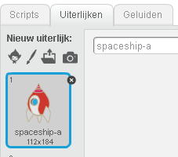
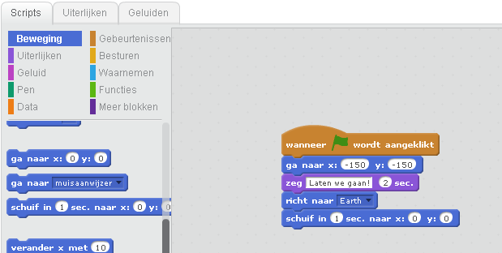
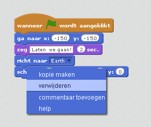
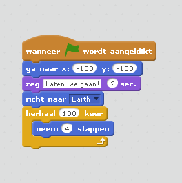
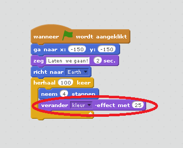
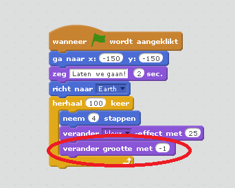
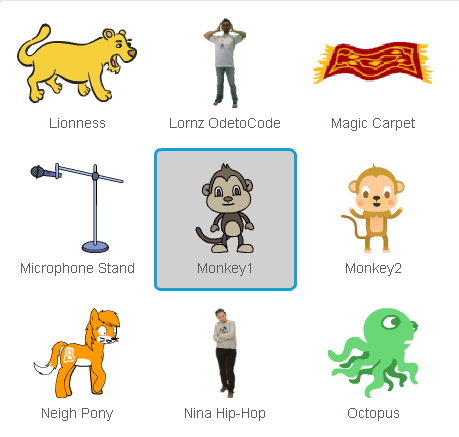
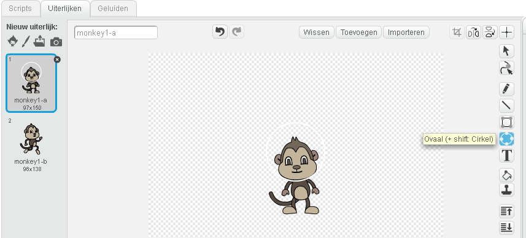

---
title: Lost in Space
level: Scratch 1
language: nl-NL
stylesheet: scratch
embeds: "*.png"
materials: ["Club Leader Resources/*"]
...

# Introduction { .intro }

Je gaat leren hoe je jouw eigen animatie kan programmeren!

<div class="scratch-preview">
  <iframe allowtransparency="true" width="485" height="402" src="http://scratch.mit.edu/projects/embed/26818098/?autostart=false" frameborder="0"></iframe>
  
</div>

# Stap 1: Een ruimteschip laten vliegen. { .activity .new-page}

Laten wij een ruimteschip maken, dat naar de aarde toe vliegt!

## Activity Checklist { .check }

+ Start een nieuw Scratch project en verwijder de sprite van de kat zodat je een leeg project hebt. Hier vind je de online versie van de Scratch editor <a href="http://jumpto.cc/scratch-new">jumpto.cc/scratch-new</a>.

+ Voeg de 'Spaceship' en 'Earth' sprites toe aan jouw speelveld. Je moet ook de 'Stars' achtergrond voor je speelveld gebruiken. Je speelveld zou er nu zo uit moeten zien:

	

+ Klik op jouw nieuwe ruimteschip en klik vervolgens op de 'Uiterlijken' tab.

	

+ Gebruik de selecteer gereedschap om de tekening te selecteren. Klik daarna op de ronde draaipuntbediening en draai de tekening tot deze op zijn zij ligt.

	

+ Voeg de volgende programmablokken toe aan jouw ruimteschip:

	

	Verander de nummers in de blokken, zodat de het programma er precies zo uitziet als in de bovenstaande afbeelding.

+ Als je op de programmablokken klikt om het programma te starten, zou je het het ruimteschip moeten zien spreken, omdraaien en zien bewegen naar het midden van het speelveld.

	

	De schermpositie `x:(0) y:(0)` {.blockmotion} is het midden van het speelveld. Een positie zoals `x:(-150) y:(-150)` {.blockmotion} is ongeveer links onder van het speelveld, en een positie zoals `x:(150) y:(150)` {.blockmotion} is ongeveer rechts boven.

	

	Als je de coördinaten van een positie van het speelveld moet weten, beweeg je de muis naar die positie en maak je een notitie van de coördinaten, welke worden weergegeven onder het speelveld.

	

+ Je kan jouw animatie uitproberen door op de groene vlag te klikken boven het speelveld.

	

## Uitdaging: Verbeter jouw animatie {.challenge}
Kan je de getallen in jouw animatieprogramma veranderen, zodat:
+ Het ruimteschip beweegt totdat het de Aarde raakt?
+ Het ruimteschip langzamer naar de Aarde beweegt?

Hiervoor moet je de getallen in dit blok veranderen:

```blocks
	glide (1) secs to x:(0) y:(0)
```


## Sla jouw project op { .save }

# Stap 2: beweging door middel van 'loops' { .activity .new-page }

Een andere manier om jouw ruimteschip te laten bewegen is door het een klein stukje te laten bewegen, maar dan vaak achter elkaar.

## Activiteiten Checklist { .check }

+ Verwijder het `schuif in` {.blockmotion} blok uit jouw programma, door met de rechter muistoets op het blok te klikken en vervolgens op 'verwijderen' te klikken. Je kan ook programmastukjes verwijderen door deze uit het script veld te slepen, terug naar de het programma blok veld.

	

+ Zodra je jouw programmadeel verwijderd hebt, zet je het volgende programmadeel ervoor in de plaats:

	

	Het `herhaal [10] keer` {.blockcontrol} blok wordt gebruikt om iets vaak te herhalen, en is ook bekend als een __'loop'__.

+ Zodra je nu op de vlag klikt om het nieuwe programma uit te proberen, zal je zien dat het programma ongeveer hetzelfde doet.

+ Je kan meer programmablokken aan jouw loop toevoegen, zodat er interessante dingen gebeuren. Voeg het `verander kleur-effect met 25` {.blocklooks} blok toe aan de loop (vanuit het 'Uiterlijken' gedeelte), om herhaaldelijk de kleur van het ruimteschip te veranderen als het beweegt:

	

+ Klik op de vlag om de vernieuwde animatie te zien.

	

+ Je kan jouw ruimteschip kleiner later worden naarmate deze richting de aarde beweegt.

	

+ Test jouw animatie. What gebeurd er als je een tweede keer op de vlag klikt? Heeft jouw ruimteschip de juiste grootte in het begin? Kan je het volgende blok gebruiken om de animatie te herstellen?:

	```scratch
	set size to (100) %
	```

## Sla jouw project op { .save }

# Stap 3: Zwevende Aap { .activity .new-page }

Laten we een aap aan de animatie toevoegen, die in de ruimte verdwaald is! 

## Activiteiten Checklist { .check }

+ Start door de monkey sprite toe te voegen vanuit de bibliotheek.

	

+ Als je op de nieuwe monkey sprite klikt en daana op de 'uiterlijken' tab klikt, kan je het uiterlijk van het aapje aanpassen. Klik op het 'Ovaal' gereedschap, en teken een witte ruimtehelm om het apenkopje.

	

+ Klik nu op de 'Scripts' tab, en voeg het volgende programma toe aan de monkey-sprite, zodat deze langzaam blijft ronddraaien:

	```blocks
		when FLAG clicked
		forever
		    turn right (1) degrees
		end
	```

	Het `herhaal` {.blockcontrol} blok is ook een 'loop', maar deze keer een die nooit stopt.

+ Klik op de vlag om jouw aapje te testen. Je zal op de rode stopknop moeten klikken (naast de vlag) om deze animatie te beëindigen.

	

# Stap 4: Botsende Astoides { .activity .new-page }

Laten we wat zwevende ruimte stenen toevoegen aan jouw animatie.

## Activiteieten Checklist { .check }

+ Voeg een 'rock' sprite toe aan jouw animatie.

	

+ Voeg het volgende programma toe aan jouw steen, zodat het rond jouw speelveld botst:

	```scratch
	when flag clicked
	point towards [Earth v]
	forever
		move (2) steps
		if on edge, bounce
	```

+ Klik op de vlag om jouw rots te testen. Botst het rond jouw speelveld?

# Stap 5: Schitterende Sterren { .activity .new-page }

Laten we meerdere 'loops' combineren eem een schitterende ster te maken.

## Activiteiten Checklist { .check }

+ Voeg een 'star' sprite toe aan jouw animatie

	

+ Voeg het volgende programma toe aan jouw ster:

	

+ Klik op de vlag om de ster animatie te testen. Wat doet dit programma? Het maakt de ster 20 keer een klein beetje groter, en dan 20 keer een beetje kleiner, terug naar zijn orginele grootte. Deze 2 'loops' zitten binnen een `herhaal` {.blockcontrol} loop, zodat de animatie zich blijft herhalen.

## Sla jouw project op { .save }

## Uitdaging: Maak jouw eigen animatie {.challenge}
Stop jouw ruimte animatie en klik op het 'Bestand' menu en dan op 'Nieuw', om een nieuw project te beginnen.

Gebruik wat je in dit project geleerd hebt om jouw eigen animatie te maken. Dat kan alles zijn wat jij wilt, maar probeer wel jouw animatie aan te passen aan zijn omgeving. Hier volgen een paar voorbeelden:


## Sla jouw project op { .save }

## Community Contributed Translation { .challenge .pdf-hidden }

This project was translated by Jeroen Dekker. Our amazing translation volunteers help us give children around the world the chance to learn to code.  You can help us reach more children by translating a Code Club project via [Github](https://github.com/CodeClub/curriculum_documentation/blob/master/contributing.md) or by getting in touch with us at hello@codeclubworld.
