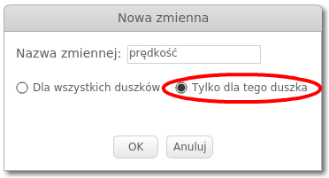
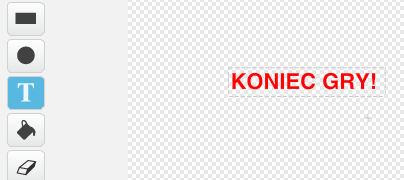

---
title: Clone Wars
level: Scratch 2
language: pl-PL
stylesheet: scratch
embeds: "*.png"
materials: ["Club Leader Resources/*"]
beta: true
...

## Projekt stworzony przez społeczność { .challenge .pdf-hidden }
Ten projekt powstał przy współpracy z Erikiem. Jeśli także chcesz zamieścić swój projekt [skontaktuj się z nami na Githubie](https://github.com/CodeClub).

# Wstęp { .intro }

Wykonując ten projekt nauczysz się, jak stworzyć grę, w której musisz uratować Ziemię przed potworami z kosmosu.

<div class="scratch-preview">
  <iframe allowtransparency="true" width="485" height="402" src="http://scratch.mit.edu/projects/embed/46018140/?autostart=false" frameborder="0"></iframe>
  
</div>

# Krok 1: Budowanie statku kosmicznego {.activity}

Zbudujmy statek kosmiczny, który będzie bronił Ziemi!

## Zadania do wykonania {.check}

+ Utwórz w Scratchu nowy projekt i usuń duszka-kota tak, aby projekt był pusty. Możesz skorzystać ze Scratcha w wersji online, który znajduje się tutaj: <a href="http://jumpto.cc/scratch-new">jumpto.cc/scratch-new</a>.

+ Do projektu dodaj tło 'stars' (gwiazdy) i duszka 'Spaceship' (statek kosmiczny). Zmiejsz statek kosmiczny i przesuń go na dół sceny.

	

+ Dodaj kod, który przesunie statek w lewo, kiedy wciśniesz strzałkę w lewo. Będziesz do tego potrzebował takich bloków:

	```blocks
		when flag clicked
		forever
			if <key [left arrow v] pressed?> then
				change x by (-4)
			end
		end
	```

+ Dodaj kod, który przesunie statek w prawo, kiedy wciśniesz strzałkę w prawo.

+ Przetestuj swój projekt i sprawdź czy statek przesuwa się kiedy wciskasz strzałki na klawiaturze.

## Zapisz swój projekt {.save}

# Krok 2: Błyskawice {.activity}

Dodajmy statkowi kosmicznemu możliwość strzelania błyskawicami!

## Zadania do wykonania {.check}

+ Z biblioteki Scratcha dodaj duszka 'Lightning' (błyskawica). Kliknij na kostium duszka i obróc go do góry nogami.

	

+ Na początku gry błyskawica powinna być ukryta. Pokażemy ją dopiero wtedy, kiedy statek kosmiczny wystrzeli ze swoich laserowych działek.

	```blocks
		when flag clicked
		hide
	```

+ Dodaj poniższy kod **do statku kosmicznego**, by utworzyć nową błyskawicę za każdym razem, kiedy wciśnięta zostanie spacja.

	```blocks
		when flag clicked
		forever
			if <key [space v] pressed?> then
				create clone of [Lightning v]
			end
		end
	```

+ Kiedy nowy klon zostanie stworzony powinien ustawić się w tym miejscu, gdzie znajduje się statek kosmiczny. Następnie powinien poruszać się w górę sceny dopóki nie dotknie krawędzi. Dodaj poniższy kod **do błyskawicy**:

	```blocks
		when I start as a clone
		go to [Spaceship v]
		show
		repeat until <touching [edge v] ?>
			change y by (10)
		end
		delete this clone
	```

  Uwaga: ustawiamy nowy klon błyskawicy na pozycję statku kosmicznego kiedy jeszcze błyskawica jest ukryta, przed jej pokazaniem. Dzięki temu gra będzie lepiej wyglądać.

+ Przetestuj swoją błyskawicę naciskając spację.

## Zapisz swój projekt {.save}

## Wyzwanie: Naprawianie błyskawicy {.challenge}
Co się dzieje, kiedy trzymasz wciśniętą spację? Użyj bloku `czekaj` {.blockcontrol}, aby to naprawić.

## Zapisz swój projekt {.save}

# Krok 3: Latające kosmo-hipcie { .activity }

Dodajmy teraz mnóstwo latających hipopotamów, które będą próbowały zniszczyć statek kosmiczny.

## Zadania do wykonania {.check}

+ Stwórz nowego duszka wykorzystując 'Hippo1' z biblioteki Scracha.

	

+ Ustaw mu styl obrotów tak, aby obracał się tylko w prawo i w lewo. Dodaj mu też poniższy kod, aby ukryć go na początku gry:

	```blocks
		when flag clicked
		hide
	```

+ Stwórz nową zmienną tylko dla tego duszka i nazwij ją `prędkość` {.blockdata}.

	

  Jeśli udało ci się to zrobić poprawnie twoja zmienna będzie miała nazwę duszka obok swojej nazwy, tak jak tutaj:

	

+ Poniższy kod utworzy nowego kosmo-hipcia co kilka sekund. Dodaj ten kod **do sceny**:

	```blocks
		when flag clicked
		forever
			wait (pick random (2) to (4)) secs
			create clone of [Hippo1 v]
		end
	```

+ Niech każdy nowy klon kosmo-hipcia na początku porusza się po scenie (z losową prędkością) tak długo, aż nie zostanie zestrzelony przez błyskawicę. Dodaj poniższy kod **do kosmo-hipcia**:

	```blocks
		when I start as a clone
		set [speed v] to (pick random (2) to (4))
		go to x: (pick random (-220) to (220)) y: (150)
		show
		repeat until <touching [lightning v] ?>
			move (speed) steps
			turn right (pick random (-10) to (10)) degrees
			if on edge, bounce
		end
		delete this clone
	```

+ Przetestuj kod kosmo-hipcia. Co kilka sekund powinien pokazywać się nowy klon kosmo-hipcia, a każdy z nich powinien posuszać się ze swoją prędkością.

	

+ Przetestuj działka laserowe. Czy trafiony błyskawicą kosmo-hipcio znika?

+ Kiedy kosmo-hipcio dotknie twojego statku kosmicznego, statek powinien eksplodować! Aby tak zrobić, najpierw musimy zmienić statek w taki sposób, aby miał dwa kostiumy: "normalny" i "trafiony".

	

  Kostium "trafiony" można wykonać importując z biblioteki Scratcha obrazek "sun" (słońce), a następnie używając narzędzia "Wypełnij kształt", aby zmienić jego kolor.

	

+ Dodaj ten kod do swojego statku, aby zmienił kostium kiedy tylko zostanie uderzony przez kosmo-hipcia:

	```blocks
		when flag clicked
		forever
			switch costume to [normal v]
			wait until <touching [Hippo1 v]>?
			switch costume to [hit v]
			broadcast [hit v]
			wait (1) secs
		end
	```

+ Czy zauważyłeś, że wysyłasz wiadomość "trafiony" w kodzie powyżej? Możesz użyć tej wiadomości, aby ukryć wszystkie kosmo-hipcie, kiedy statek zostanie trafiony przez jednego z nich.

	Dodaj poniższy kod do kosmo-hipcia:

	```blocks
		when I receive [hit v]
		delete this clone
	```

+ Przetestuj ten kod - uruchom nową grę i pozwól, aby uderzył cię kosmo-hipcio.

	

## Zapisz swój projekt {.save}

## Wyzwanie: Życia i punkty {.challenge}
Czy potrafisz dodać `życia` {.blockdata}, `punkty` {.blockdata}, albo nawet `najlepszy wynik` {.blockdata} do swojej gry? Pomocy szukaj w projekcie "Catch the Dots".

## Zapisz swój projekt {.save}

# Krok 4: Owocowe nietoperze! { .activity }

Stworzymy teraz owocowe nietoperze, które będą rzucać pomarańczami w twój statek kosmiczny.

## Zadania do wykonania {.check}

+ Najpierw stwórz nowego duszka - nietoperza, który będzie `zawsze` {.blockcontrol} `przesuwał się` {.blockmotion} wzdłuż górnej krawędzi sceny. Pamiętaj, żeby przetestować swój kod.

	

+ Jeśli spojrzysz na kostiumy nietoperza, to zobaczysz, że są tam już 2 kostiumy:

	

  Użyj bloku `następny kostium` {.blocklooks}, aby nietoperz machał skrzydłami kiedy lata.

+ Stwórz nowego duszka korzystając z 'Orange' (pomarańcza) z biblioteki Scratcha.

	

+ Do nietoperza dodaj kod, który utworzy nowy klon pomarańczy co kilka sekund.

	```blocks
		when flag clicked
		forever
			wait (pick random (5) to (10)) secs
			create clone of [Orange v]
		end
	```

+ Kliknij na pomaranczę i dodaj ten kod, aby każdy klon spadał na scenie od nietoperza w kierunku statku kosmicznego:

	```blocks
		when flag clicked
		hide

		when I start as a clone
		go to [Bat1 v]
		show
		repeat until <touching [edge v]?
			change y by (-4)
		end
		delete this clone

		when I receive [hit v]
		delete this clone
	```

+ Musisz teraz zmienić swój kod w statku kosmicznym, aby został trafiony, kiedy dotknie albo kosmo-hipcia albo pomarańczy:

	```blocks
		wait until < <touching [Hippo1 v]?> or <touching [Orange v]?>>
	```

+ Przetestuj swoją grę. Co się stanie kiedy w statek uderzy pomarańcza?

## Zapisz swój projekt {.save}

# Krok 5: Koniec gry { .activity }

Dodajmy komunikat "Koniec gry".

## Zadania do wykonania {.check}

+ Jeśli nie zrobiłeś tego wcześniej dodaj nową zmienną i nazwij ją `życia` {.blockdata}. Twój statek kosmiczny powinien zaczynać z 3 życiami i tracić po jednym kiedy zostanie trafiony przez wroga. Gra powinna się zakończyć, kiedy skończą ci się życia. Jeśli potrzebujesz pomocy możesz użyć kodu z projektu "Catch the Dots".

+ Narysuj nowego duszka "Koniec gry" używając narzędzia do pisania tekstu.

	

+ Nadaj wiadomość `koniec gry` {.blockevents} na scenie zaraz przed końcem gry.

	```blocks
		broadcast [game over v] and wait
	```

+ Dodaj ten kod do duszka "Koniec gry", aby wiadomość pokazała się na końcu gry:

	```blocks
		when flag clicked
		hide

		when I receive [game over v]
		show
	```

  Ponieważ na scenie użyłeś bloku `nadaj [koniec gry] i czekaj` {.blockevents}, gra poczeka, aż pojawi się duszek "Koniec gry" zanim gra się naprawdę zakończy.

+ Przetestuj swoją grę. Ile punktów udało ci się zdobyć? Jak możesz udoskonalić grę, jeśli jest za prosta albo za trudna?

## Zapisz swój projekt {.save}

## Wyzwanie: Usprawnij swoją grę {.challenge}
Jakie ulepszenia możesz dodać do swojej gry? Oto kilka pomysłów:
+ dodaj apteczki, które możesz zbierać, aby zdobyć dodatkowe życia;


+ Dodaj ruchome skały, które statek kosmiczny musi omijać;


+ Kiedy zdobędziesz 100 punktów niech pojawia się wtedy więcej przeciwników.

```blocks
	wait until <(score) = [100]>
```

## Zapisz swój projekt {.save}
