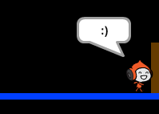
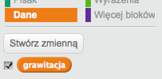
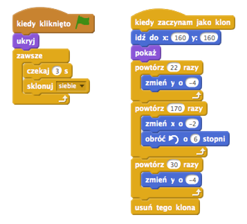
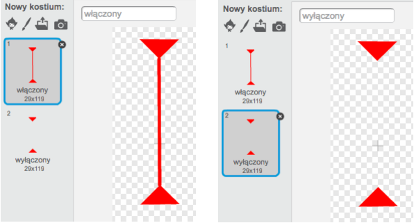

---
title: Dodgeball
level: Scratch 2
language: pl-PL
stylesheet: scratch
embeds: "*.png"
materials: ["Club Leader Resources/*.*","Project Resources/*.*"]
...

# Wstęp { .intro }

Tym razem nauczymy się, jak stworzyć grę platformową, w której musisz unikać kulających się piłek, aby dojść do końca planszy.

<div class="scratch-preview">
	<iframe allowtransparency="true" width="485" height="402" src="http://scratch.mit.edu/projects/embed/39740618/?autostart=false" frameborder="0"></iframe>
	
</div>

# Krok 1: Poruszanie postacią { .activity }

Zacznijmy od stworzenia postaci, którą będzie można poruszać w lewo i w prawo oraz wspinać się po słupach.

## Zadania do wykonania { .check }

+ Stwórz nowy projekt i usuń duszka-kota, aby projekt był pusty.

+ Aby wykonać ten projekt, powinieneś mieć katalog "Zasoby", w którym znajdziesz obrazek tłą, którego będziesz potrzebować. Upewnij się, że masz ten katalog, a jeśli nie zapytaj o niego prowadzącego.

	

+ Ustaw nowe tło sceny z pliku "background.png" lub narysuj własne! Jeśli rysujesz własny poziom zadbaj o to, by słupy i podłogi były miały różne kolory. Narysuj także drzwi (lub coś podobnego), gdzie twoja postać będzie musiała dojść. Projekt powinien wyglądać mniej więcej tak:

	

+ Dodaj nowego duszka, którym będzie kierował gracz. Gra będzie ciekawsza, jeśli wybierzesz duszka z wieloma kostiumami - dzięki temu będziesz mógł sprawić, że będzie wyglądać jakby się poruszał.

	

+ Użyjmy klawiszy ze strzałkami, aby poruszać postacią. Kiedy gracz naciśnie strzałkę w prawo, twoja postać powinna obrócić się w prawo, przejść kilka kroków i zmienić kostium:

	```blocks
		kiedy kliknięto zieloną flagę
		zawsze
			jeżeli <klawisz [strzałka w prawo v] naciśnięty? > to
				ustaw kierunek na (90 v)
				przesuń o (3) kroków
				następny kostium
			koniec
		koniec
	```

+ Przetestuj postać klikając na zieloną flagę, a następnie wciskając strzałkę w prawo. Czy duszek przesuwa się w prawo? Czy postać wygląda jakby chodziła?

	

+ Aby przesunąć postać w lewo musisz dodać kolejny blok `jeżeli` {.blockcontrol} w środku pętli `zawsze` {.blockcontrol}. Pamiętaj o przetestowaniu nowego kodu, żeby sprawdzić czy działa prawidłowo!

+ Aby wspinać się po słupie, twoja postać powinna płynnie przesuwać się do góry kiedy jest wciśnięta strzałka w górę i postać dotyka odpowiedniego koloru. Dodaj poniższy kod w środku pętli `zawsze` {.blockcontrol} twojej postaci:

	```blocks
		jeżeli < <klawisz [strzałka w górę v] naciśnięty?> i <dotyka koloru [#FFFF00]?> > to
			zmień y o (4)
		koniec
	```

+ Przetestuj swoją postać - czy może wspinać się po żółtym słupie i dojść do końca planszy?

	

## Zapisz swój projekt { .save }

## Wyzwanie: Koniec planszy {.challenge}
Czy możesz dodać trochę kodu do twojej postaci, aby powiedziała coś `jeżeli` {.blockcontrol} dotrze do brązowych drzwi?



## Zapisz swój projekt { .save }

# Krok 2: Grawitacja i skakanie { .activity }

Sprawmy, by postać poruszała się bardziej realistycznie. W tym celu dodamy grawitację i nauczymy ją skakać.

## Zadania do wykonania { .check }

+ Jak pewnie zauważyłeś twoja postać może zejść z platformy i dalej chodzić w powietrzu. Spróbuj zejść z platformy i zobaczyć co się stanie.

	

+ Aby to poprawić dodamy do gry grawitację. Stwórz nową zmienną i nazwij ją `grawitacja` {.blockdata}. Jeśli chcesz możesz ukryć tą zmienną, by nie była widoczna na scenie.

	

+ Dodaj poniższy blok kodu, który ustawia grawitację na liczbę ujemną, a następnie używa jej do zmiany współrzędnej y twojej postaci.

	```blocks
		kiedy kliknięto zieloną flagę
		ustaw [grawitacja v] na [-4]
		zawsze
			zmień y o (grawitacja)
		koniec
	```

+ Kliknij na zieloną flagę i przeciągnij swoją postać na górę sceny. Co się dzieje? Czy grawitacja działa tak, jak się tego spodziewałeś?

	

+ Grawitacja nie powinna przesuwać twojej postaci, kiedy znajduje się ona na platformie albo na słupie! Dodaj blok `jeżeli` {.blockcontrol} do twojego kodu w ten sposób, by grawitacja działałą tylko, gdy postać jest w powietrzu. Kod grawitacji powinien wyglądać tak:

	```blocks
		kiedy kliknięto zieloną flagę
		ustaw [grawitacja v] na [-4]
		zawsze
			jeżeli < nie < <dotyka koloru [#0000FF]?> lub <dotyka koloru [#FFFF00]?> > > to
				zmień y o (grawitacja)
			koniec
		koniec
	```

+ Przetestuj grawitację ponownie. Czy twoja postać zatrzymuje się kiedy trafi na platformę lub słup? Czy możesz zejść z wyższej platformy na niższą kiedy dojdziesz do jej krawędzi?

	

+ Dodajmy teraz postaci możliwość skakania, kiedy gracz naciśnie spację. Jest na to jeden bardzo łatwy sposób - przesuń postać kilka razy w górę używając takiego kodu:

	```blocks
		kiedy klawisz [spacja v] naciśnięty
		powtórz (10) razy
			zmień y o (4)
		koniec
	```

	Ponieważ grawitacja nieustannie ciągnie postać w dół o 4 piksele, musisz wybrać liczbę większą od 4 w bloku `zmień y o (4)` {.blockmotion}. Zmieniaj tę liczbę tak długo, aż wysokość skoku będzie dla ciebie zadowalająca.

+ Kiedy będziesz testować ten kod zobaczysz, że działa, ale ruch twojej postaci nie jest zbyt płynny. By sprawić, że skoki są bardziej naturalne, powinieneś przesuwać postać w górę o coraz mniejszą wartość.

+ Aby to zrobić, stwórz kolejną zmienną i nazwij ją `wysokość skoku` {.blockdata}. Możesz ukryć tą zmienną jeśli chcesz, tak jak poprzednio.

+ Usuń blok kodu od skakania, który dodałeś do postaci i zamień go na poniższy:

	```blocks
		kiedy klawisz [spacja v] naciśnięty
		ustaw [wysokość skoku v] na [8]
		powtarzaj aż < (wysokość skoku) = [0] >
			zmień y o (wysokość skoku)
			zmień [wysokość skoku v] o (-0.5)
		koniec
	```

	Ten kod przesunie twoją postać w górę najpierw o 8 pikseli, następnie o 7,5 piksela, o 7 pikseli i tak dalej aż do momentu, w którym postać skończy skok. To sprawia, że skok wydaje się dużo płynniejszy.

+ Zmieniaj początkową wartość zmiennej `wysokość skoku` {.blockdata} i sprawdź, jaka wartość będzie najlepsza dla twojej postaci.

## Zapisz swój projekt { .save }

## Wyzwanie: Jeszcze lepsze skoki {.challenge}
Twoja postać może teraz skakać kiedy tylko spacja jest naciśnięta, nawet jeśli jest wtedy w powietrzu. Możesz to zobaczyć trzymając spację wciśniętą. Czy potrafisz to naprawić tak, by postać mogła skakać tylko `jeżeli` {.blockcontrol} dotyka niebieskiej platformy?

## Zapisz swój projekt { .save }

# Krok 3: Omijanie piłek { .activity .new-page}

Teraz, kiedy masz już postać, którą możesz sterować, dodajmy parę piłek, które będzie ona musiała omijać.

## Zadania do wykonania { .check }

+ Swtórz nowego duszka - piłkę. Możesz wybrać dowolny typ.

	

+ Zmień wielkość piłki w taki sposób, by twoja postać mogła ją przeskoczyć. Przeskocz nad piłką by sprawdzić, czy piłka jest wystarczająco mała.

	

+ Dodaj taki kod do twojej piłki:

	

	Ten kod tworzy nowy klon piłki co 3 sekundy. Każdy klon porusza się wzdłuż górnej platformy.

+ Kliknij w zieloną flagę, aby zobaczyć jak to działa.

	

+ Dodaj więcej kodu do twojej piłki tak, by toczyła się po wszystkich trzech platformach.

	

+ Teraz nadszedł czas na dodanie kodu, który sprawdzi czy piłka uderzyła w twoją postać! Dodaj taki kod do piłki:

	```blocks
		kiedy zaczynam jako klon
		zawsze
			jeżeli < dotyka [Pico walking v]? > to
				nadaj [uderzony v]
			koniec
		koniec
	```

+ Musisz dodać także kod do twojej postaci, by przesunąć ją na początek, kiedy zostanie uderzona:

	```blocks
		kiedy otrzymam [uderzony v]
		ustaw kierunek na (90 v)
		idź do x: (-210) y: (-120)
	```	

+ Przetestuj swoją postać i zobacz czy wraca na start, kiedy piłka ją uderzy.

## Zapisz swój projekt { .save }

## Wyzwanie: Losowe piłki {.challenge}
Wszystkie piłki, które musi przeskakiwać twoja postać są identyczne i zawsze pojawiają się co 3 sekundy. Czy możesz ulepszyć je w taki sposób, aby:

+ różniły się od siebie wyglądem?
+ pojawiały się w losowym momencie?
+ były różnej wielkości?


## Zapisz swój projekt { .save }

# Krok 4: Lasery! { .activity .new-page}

Sprawmy, by twoja gra była nieco trudniejsza do przejścia dodając lasery!

## Zadania do wykonania { .check }

+ Dodaj nowego duszka do twojej gry i nazwij go "Laser". Powinien mieć 2 kostiumy o nazwach "włączony" i "wyłączony".

	

+ Dodaj laser gdzie tylko chcesz pomiędzy platformami.

	

+ Dodaj kod do lasera, by przełączał na zmianę swoje kostiumy:

	```blocks
		kiedy kliknięto zieloną flagę
		zawsze
			zmień kostium na [włączony v]
			czekaj (2) s
			zmień kostium na [wyłączony v]
			czekaj (2) s
		koniec
	```

	Jeśli chcesz, możesz `czekać` {.blockcontrol} `losową` {.blockoperators} ilość czasu pomiędzy zmianą kostiumów.

+ Teraz dodaj kod do lasera, by nadawał wiadomość 'uderzony', kiedy laser dotknie twojej postaci. To będzie taki sam kod, jak ten, który dodałeś do piłki.

	Nie musisz dodawać żadnego kodu do twojej postaci - ona już wie co zrobić kiedy zostanie uderzona!

+ Przetestuj swoją grę i sprawdź czy możesz przejść przez laser. Jeśli lasery są za proste lub za trudne możesz zmienić czasy `czekania` {.blockcontrol}.

## Wyzwanie: Więcej przeszkód {.challenge}
Jeśli uważasz, że twoja gra ciągle jest za prosta, możesz dodać więcej przeszkód na planszy. To może być co tylko chcesz. Oto kilka podpowiedzi:

+ latający jadowity motyl,
+ platformy, które pojawiają się i znikają,
+ spadające piłki tenisowe, które trzeba omijać.


Możesz nawet stworzyć więcej niż jedno tło sceny i przechodzić na następny poziom, kiedy postać dojdzie do brązowych drzwi:

```blocks
	jeżeli <dotyka koloru [#714300]?> to
		zmień kostium na [next backdrop v]
		idź do x: (-210) y: (-120)
		czekaj (1) s
	end
```

## Zapisz swój projekt { .save }

## Wyzwanie: Usprawniona grawitacja {.challenge}
W twojej grze jest jeszcze jeden mały błąd: grawitacja nie przyciąga w dół twojej postaci jeśli _jakakolwiek_ jej część dotyka niebieskiej platformy - nawet jeśli dotyka jej głową! Możesz to sprawdzić wspinając się prawie do końca słupa i ruszyć w lewo.


Czy potrafisz naprawić ten błąd? Aby to zrobić będziesz musiał dać twojej postaci spodnie, które różnią się kolorem od reszty (zmień to we _wszystkich_ kostiumach)...


...i zamienić ten kod: 

```blocks
	< dotyka koloru [#0000FF]? >
```

na taki:

```blocks
	< czy kolor [#00FF00] dotyka [#0000FF]? >
```

Pamiętaj, żeby przetestować to usparwnienie i sprawdzić czy udało się naprawić błąd!

## Zapisz swój projekt { .save }

## Wyzwanie: Więcej żyć {.challenge}
Możesz dać graczowi 3 `życia` {.blockdata}, zamiast po prostu wysyłać go z powrotem na początek za każdym razem. Oto, jak może działać twoja gra:

+ gracz zaczyna z trzema życiami,
+ kiedy gracz zostanie uderzony traci jedno życie i wraca na start,
+ jeśli nie zostało mu już więcej żyć gra się kończy.

## Zapisz swój projekt { .save }
