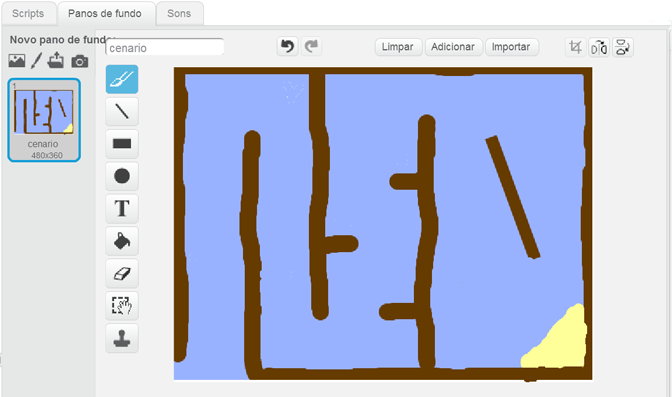
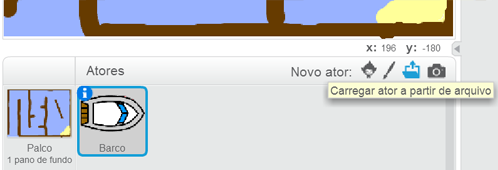
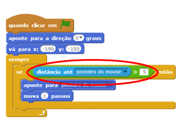
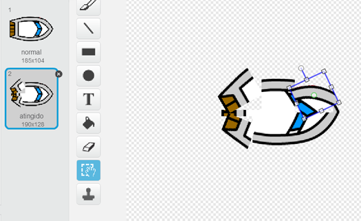
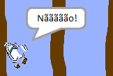
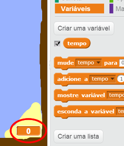
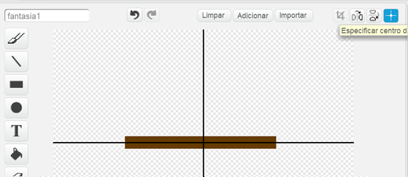
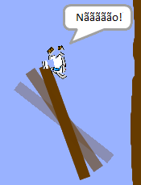
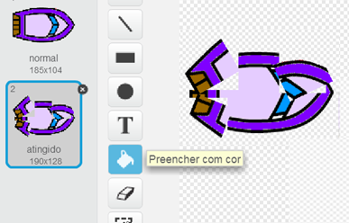

---
title: Corrida de Barco
level: Scratch 1
language: pt-BR
stylesheet: scratch
embeds: "*.png"
materials: ["Recursos para o Instrutor/*","Recursos para o Projeto/*"]
...

# Introdução { .intro }

Você vai aprender a fazer um jogo, no qual você usará o mouse para navegar um barco até uma ilha deserta.

<div class="scratch-preview">
  <iframe allowtransparency="true" width="485" height="402" src="http://scratch.mit.edu/projects/embed/63957956/?autostart=false" frameborder="0"></iframe>
  
</div>

# Passo 1: Planejando o seu jogo { .activity }

## Lista de Atividades { .check }

+ Comece um novo projeto Scratch, e delete o ator gato para que seu projeto fique vazio. Você pode encontrar o editor online do Scratch clicando em Criar em <a href="http://scratch.mit.edu">scratch.mit.edu</a>. Caso o site não esteja em português, peça ajuda para o instrutor!

+ Clique no seu pano de fundo do palco e planeje seu nível. Você deverá adicionar:
	+ Madeira que o barco tem que desviar;
	+ Uma ilha deserta onde seu barco barco tem de chegar.

	Veja como o seu jogo poderá ficar:

	 

# Passo 2: Controlando o barco { .activity .new-page}

## Lista de Atividades { .check }

+ Se seu líder de clube lhe deu a pasta 'Recursos', clique em 'Carregar traje a partir de arquivo' e adicione a imagem 'barco.png'. Você deve encolher o ator e colocá-lo na sua posição inicial.

	

	Se você não tem a imagem barco.png, você pode desenhar o seu próprio!

+ Você controlará o barco com seu mouse. Adicione este código para seu barco:

	```blocks
		quando clicar em ⚑
		aponte para a direção (0 v) graus
		vá para x:(-190) y:(-150)
		sempre
		   aponte para [ponteiro do mouse v]
		   mova (1) passos
		end
	```

+ Teste o seu barco, clicando na bandeira e movendo o mouse. O barco veleja em direção ao mouse?

	

+ O que acontece se o barco alcança o ponteiro do mouse?

	Para evitar que isso aconteça, você precisará adicionar um bloco `se` {.blockcontrol} no seu código, de modo que o barco apenas se movimente se ele estiver a mais de 5 pixels de distância do mouse.

		

+ Teste seu barco novamente para conferir se o problema foi corrigido.

## Salve seu projeto { .save }

# Passo 3: Colidindo! { .activity .new-page }

Seu barco pode velejar através das barreiras de madeira! Vamos corrigir isso.

## Lista de Atividades { .check }

+ Você precisará de 2 fantasias para seu barco, uma fantasia normal, e uma para quando o barco colidir. Duplique a fantasia do seu barco, e as nomeie como 'normal' e 'atingido'.

+ Clique na sua fantasia 'atingido', e escolha a ferramenta 'Selecionar' para pegar pedaços do barco e mover e girar em torno deles. Faça seu barco parecer como se ele tivesse colidido.

	

+ Adicione este código para o seu barco, dentro do loop `sempre` {.blockcontrol}, de modo que ele colida quando tocar qualquer pedaço de madeira marrom:

	```blocks
		se <tocou na cor [#603C15]?> então
		   mude para a fantasia [atingido v]
		   diga [Nãããão!] por (1) segundos
		   mude para a fantasia [normal v]
		   aponte para a direção (0 v) graus
		   vá para x:(-215) y:(-160)
		end
	```

	Esse código está no interior do loop `sempre` {.blockcontrol}, para que o código mantenha-se verificando se o barco colidiu.

+ Você também deve se certificar de que o seu barco sempre começa como 'normal'.

+ Agora se você tentar navegar através de uma barreira de madeira, você deverá ver que seu barco colide e retorna ao início.

	

## Salve seu projeto { .save }

## Desafio: Vencendo! {.challenge}
Você pode adicionar outro `se` {.blockcontrol} para o código do seu barco, de modo que o jogador vença quando ele chegar na ilha deserta?

Quando o barco chegar na ilha deserta amarela, ele deve dizer 'YEAH!' e então o jogo deve parar. Você precisará usar este código:

```blocks
	diga [YEAH!] por (1) segundos
	pare [todos v]
```


## Salve seu projeto { .save }

## Desafio: Efeitos sonoros {.challenge}
Você pode adicionar efeitos sonoros para seu jogo, para quando o barco colidir, ou alcançar a ilha no final. Você pode até mesmo adicionar música de fundo (veja o projeto 'Rock Band', se você precisar de ajuda para isso).

## Salve seu projeto { .save }

# Passo 4: Contra-relógio { .activity }

Vamos adicionar um cronômetro no seu jogo, de modo que o jogador tenha que chegar à ilha deserta o mais rápido possível.

## Lista de Atividades { .check }

+ Adicione uma nova variável chamada `tempo` {.blockdata} para seu palco. Você também pode mudar a exibição de sua nova variável. Se você precisar de ajuda, olhe o projeto 'Balões'.

	

+ Adicione este código para seu __palco__, de modo que o cronômetro conte até que o barco alcance a ilha deserta:

	```blocks
		quando clicar em ⚑
		mude [tempo v] para [0]
		sempre
		   espere (0.1) seg
		   adicione a [tempo v] (0.1)
		end
	```

+ É isso aí! Teste seu jogo e veja o quão rápido você consegue chegar na ilha deserta!

	

## Salve seu projeto { .save }

# Passo 5: Obstáculos e aceleradores { .activity }

Este jogo é de _longe_ muito fácil - vamos adicionar coisas para torná-lo mais interessante.

## Lista de Atividades { .check }

+ Primeiro vamos adicionar alguns 'aceleradores' no seu jogo, que irão aumentar a velocidade do barcos. Edite seu plano de fundo e adicione algumas flechas brancas, como se fossem correntes de água para impulsionar o seu barco.

	

+ Agora você pode adicionar código no laço `sempre` {.blockcontrol}, de modo que ele se mova dois passos _extra_ quando tocar as marcas brancas.

	```blocks
		se <tocou na cor [#FFFFFF]?> então
			mova (3) passos
		end
	```

+ Você também pode adicionar um portão giratório, o qual seu barco deverá evitar. Adicione um novo ator chamado 'portão', que se parece com isto:

	

	Certifique-se de que a cor do portão é a mesmo que as outras barreiras de madeira.

+ Defina o centro do ator portão.

	

+ Adicione código para seu portão, para fazê-lo girar lentamente `sempre` {.blockcontrol}.

+ Teste seu jogo. Agora você dever ter um portão giratório que você deve desviar.

	

## Salve seu projeto { .save }

## Desafio: Mais obstáculos! {.challenge .new-page}
Você consegue adicionar mais obstáculos no seu jogo? Aqui estão algumas ideias:

+ Você poderia adicionar lodo verde para seu pano de fundo, o qual diminui a velocidade do jogador quando ele tocar. Você pode usar o bloco `espere` {.blockcontrol} para fazer isso:

```blocks
	espere (0.01) seg
````


+ Você poderia adicionar um objeto em movimento, como uma tora ou tubarão!


Estes blocos podem ajudá-lo:

```blocks
	mova (1) passos
	se tocar na borda, volte
````

Se o seu novo objeto não é marrom, você precisa adicionar ao código do seu barco:

```blocks
	se <<tocou na cor [#603C15]?> ou <tocar em [shark v]?>> então
	end
```

## Salve seu projeto { .save }

## Desafio: Mais barcos! {.challenge .new-page}
Você pode transformar seu jogo em uma corrida entre dois jogadores?

+ Duplique o barco, renomeie para 'Jogador 2' e mude sua cor.



+ Mude a posição inicial do 'Jogador 2', mudando seu código:

```blocks
	vá para x:(-190) y:(-150)
```

+ Exclua o código que usa o mouse para controlar o barco:

```blocks
	se <(distância até [ponteiro do mouse v]) > [5]> então
		aponte para [ponteiro do mouse v]
		mova (1) passos
	end
```

...e substitua com o código para controlar o barco usando as setas do teclado.

Este é o código que você precisará para mover o barco para a frente:

```blocks
	se <tecla [seta acima v] pressionada?> então
		mova (1) passos
	end
```

Você também vai precisar de código para `girar` {.blockmotion} o barco quandoa as setas esquerda e direita são pressionadas.

## Salve seu projeto { .save }

## Desafio: Mais níveis! {.challenge .new-page}
Você pode criar cenários adicionais e permitir que o jogador escolha entre níveis?

```blocks
	quando pressionar tecla [espaço v]
	próximo pano de fundo
```


## Salve seu projeto { .save }

## Community Contributed Translation { .challenge .pdf-hidden }

This project was translated by Leonardo Nerone and Luis Moneda. Our amazing translation volunteers help us give children around the world the chance to learn to code.  You can help us reach more children by translating a Code Club project via [Github](https://github.com/CodeClub/curriculum_documentation/blob/master/contributing.md) or by getting in touch with us at hello@codeclubworld.