---
title: Brain Game
level: Scratch 2
language: pt-BR
stylesheet: scratch
embeds: "*.png"
materials: ["Club Leader Resources/*"]
...

# Introdução { .intro }

Neste projeto você aprederá a construir um jogo com a tabuada, no qual o jogador terá que acertar quantas respostas forem possíveis em 30 segundos. 

<div class="scratch-preview">
  <iframe allowtransparency="true" width="485" height="402" src="http://scratch.mit.edu/projects/embed/42225768/?autostart=false" frameborder="0"></iframe>
  
</div>

# Passo 1: Criando as questões { .activity }

Vamos começar criando questões aleatórias para o nosso jogador responder. 

## Lista de atividades { .check }

+ Como um novo projeto no Scratch, delete o ator do gato para que ele fique vazio. Você pode acessar o editar online do Scratch em <a href="http://jumpto.cc/scratch-new">jumpto.cc/scratch-new</a>.

+ Escolha um personagem e um pano de fundo para o seu jogo. Você pode escolher qualquer um que goste, aqui temos um exemplo:

		

+ Crie duas novas variáveis chamadas `número 1` {.blockdata} e `número 2` {.blockdata}. Essas variáveis irão guardar os dois valores que serão multiplicados.

	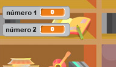

+ Adicione o código para o seu personagem, assim você coloca um número `aleatório` {.blockoperators} entre 2 e 12 nas suas duas variáveis.

	```blocks
		quando clicar em ⚑
		mude [número 1 v] para (escolha número entre (2) e (12))
		mude [número 2 v] para (escolha número entre (2) e (12))
	```

+ Nós podemos pedir ao jogador que responda e avisar se ele errou ou acertou a resposta. 

	```blocks
		quando clicar em ⚑
		mude [número 1 v] para (escolha número entre (2) e (12))
		mude [número 2 v] para (escolha número entre (2) e (12))
		pergunte (junte (número 1) com (junte [x] com (número 2))) e espere a resposta
		se <(resposta) = ((número 1) * (número 2))> então
		   diga [Isso! :)] por (2) segundos
		senão
		   diga [não :(] por (2) segundos
		end
	```

+ Teste todo o seu projeto. Lembre-se de responder uma questão corretamente e de errar outra! 

+ Adicione um bloco de loop `sempre` {.blockcontrol} em torno deste código, assim o jogador será questionado várias vezes! 

+ Crie um contador para o palco, use uma variável chamada `tempo` {.blockdata}. O projeto "Balões" possui instruções para construir um contador (o Passo 6), caso você precise de ajuda. 

+ Teste o seu projeto novamente, você deve ser capaz de responder perguntas até o tempo se esgotar. 

## Salve seu projeto { .save }

## Desafio: Trocando fantasias {.challenge}
Você consegue mudar as fantasias do seu personagem para que eles reajam às respostas do jogador? 

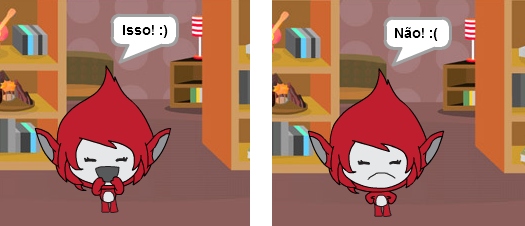

## Desafio: Adicionando pontos {.challenge}
Você consegue adicionar um sistema de pontuação ao seu jogo? VocÇe pode adicionar um ponto a cada resposta certa. Se você estiver se sentindo meio malvadinho, você pode até zerar os pontos do jogador quando ele errar uma questão! 

## Salve seu projeto { .save }

# Passo 2: Várias partidas { .activity .new-page}

Vamos adicionar um botão de 'Jogar' ao seu jogo, então o seus jogadores poderão jogar várias vezes. 

## Lista de atividades { .check }

+ Crie um ator para o botão de "Jogar", no qual o seu jogador irá clicar para começar uma partida. Você pode desenhar o seu próprio botão, ou editar um que já venha na biblioteca do Scratch.

	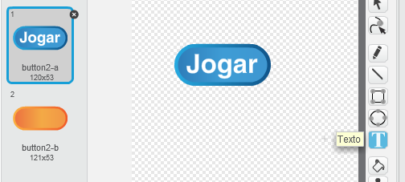

+ Adicione esse código ao novo botão-.

	```blocks
		quando clicar em ⚑
		mostre

		quando este ator for clicado
		esconda
		envie [iniciar v] a todos
	```

	Esse botão mostra o botão de "Jogar" assim que o seu projeto é iniciado. Quando o botão é clicado, ele é escondido e envia uma mensagem que irá fazer o jogo iniciar. 
	
+ Você precisará editar o código do seu personagem, assim o jogo irá começar quando receber a mensagem `iniciar` {.blockevents}, e não quando a bandeira verde é clicada.

	Substitua o `quando clicar em ⚑` {.blockevents} para `quando receber [iniciar v]` {.blockevents}.

	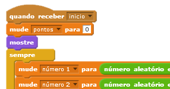

+ Clique na bandeira verde e então no seu novo botão para testá-lo. Você deve ver que o jogo não começa até que você clique no botão.

+ Você notou que o contador começa quando a bandeira verde é clicada e não quando o jogo começa? 

	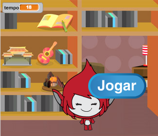

	Conseguimos arrumar esse problema?

+ Clique no palco, substitua o bloco `pare [todos v]` {.blockcontrol} com uma mensagem `fim` {.blockevents}.

	

+ Você pode adicionar o seguinte código ao seu botão, assim ele aparece novamente ao final do jogo e o jogador pode recomeçar a partida. 

	```blocks
		quando eu ouvir [fim v]
		mostre
	```

+ Você também precisa fazer com o que o seu personagem pare de fazer questões quando cada partida terminar: 

	```blocks
		quando eu ouvir [fim v]
		pare [outros scripts do ator v]
	```

+ Teste o seu botão jogando algumas partidas. O botão de "Jogar" deve aparecer após cada uma das partidas. Para que o teste fique mais fácil, você pode encurtar o tempo do jogo, assim ele termina após poucos segundos. 

	```blocks
		mude [tempo v] para [10]
	```

+ Você pode mudar a aparência do botão quando o mouse passa por cima dele: 

	```blocks
		quando clicar em ⚑
		mostre
		sempre
		   se <tocar em [ponteiro do mouse v]?> então
		      mude o efeito [olho de peixe v] para (30)
		   senão
		      mude o efeito [olho de peixe v] para (0)
		   end
		end
	```

	

## Salve seu projeto { .save }

## Desafio: Tela iniciar {.challenge}
Você consegue adicionar outro pano de fundo ao seu palco, que seria a tela inicial do seu jogo? Você pode utilizar os blocos `quando receber [iniciar v]` {.blockevents} e `quando receber [fim v]` {.blockevents} para fazer a troca entre panos de fundo.

Você também pode mostrar ou esconder o seu personagem, ou mesmo mostrar ou não o contador usando esses blocos:

```blocks
mostre variável [tempo v]
```
```blocks
esconde variável [tempo v]
```

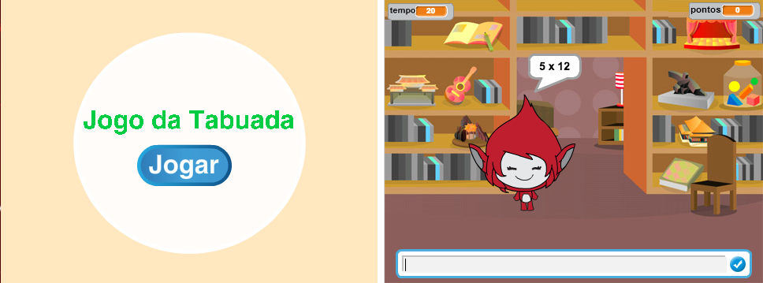

## Salve seu projeto { .save }

# Passo 3: Adicionando gráficos { .activity .new-page}

Ao invés do seu personagem apenas dizer `Isso! :)` ou `não :(` ao jogador, vamos adicionar alguns efeitos gráficos que farão o jogador saber como eles estão indo.

+ Crie um novo ator e chame-o de 'Resultado', ele deve possuir um sinal de certo e uma cruz que indique errado como fantasias.

	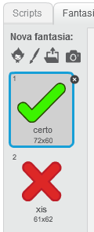

+ Mude o código do seu personagem, então, ao invés de dizer ao jogador como ele está indo, ele irá enviar a mensagem `correto` {.blockevents} e `errado` {.blockevents}.

	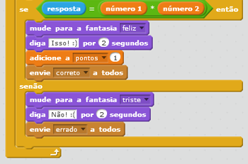

+ Você agora pode usar essas mensagem para mostrar o sinal de correto ou a cruz de errado. Adicione esse código ao seu ator "Resultado":

	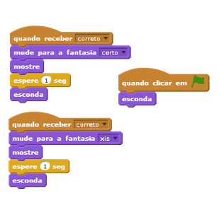	

+ TTeste o se jogo novamente, você deverá ver a o sinal de correto nos casos de resposta certa e a cruz quando a resposta estiver errada. 

	

+ Você notou que o código para a mensagem `quando receber [correto v]` {.blockevents} e `quando receber [erradi v]` {.blockevents} é quase identico? Vamos criar uma função para facilitar as mudanças que você faz no seu código. 

	No seu ator 'Resultado', clique em `Mais Blocos` {.blockmoreblocks}, então em 'Criar um bloco'. Crie uma nova função chamada `animar` {.blockmoreblocks}.

	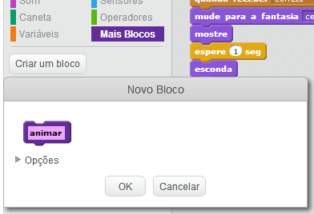

+ Você pode então adicionar o código de animação que fizemos à sua nova função de animação, e depois apenas usar essa função duas vezes:

	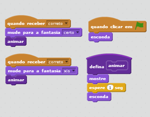

+ Agora, se você quiser mostrar o sinal de correto ou errado por mais tempo, você precisa mudar apenas uma vez o código (na sua função). Tente fazer alguma modificação assim! 

+ Ao invés de apenas mostar ou esconder o sinal de correto e errado, você poderá modificar a sua função de animação para que eles apareçam aos poucos. 

	```blocks
		defina [animar]
		mude o efeito [fantasma v] para (100)
		mostre
		repita (25) vezes
		   adicione ao efeito [fantasma v] (-4)
		end
		esconda
	```

## Salve seu projeto { .save }

## Desafio: Melhorando a animação {.challenge}
Você consegue melhorar a animação dos seus gráficos? Você pode tentar fazer com que elas também desapareçam aos poucos, ao invés de ter esse efeito apenas quando elas aparecem. Você poderia usar outros efeitos legais também:

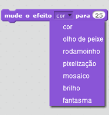

## Salve seu projeto { .save }

## Desafio: Som e música {.challenge}
Você consegue adicionar efeitos sonoros e música ao seu jogo? Por exemplo: 

+ Tocando um determinado som quando o jogador acerta ou erra uma questão;
+ Adicionar um som ao contador para cada segundo que ele decresce;
+ Tocar um aviso quando o tempo tiver esgotado;

	```blocks
		toque o tambor (10 v) por (0.1) batidas
	```

+ Você também pode tocar uma música constantemente em loop (repetição). Caso você não lembre como fazer isso, dê uma olhada no Passo 4 do projeto "Rock Band".

## Salve seu projeto { .save }

## Desafio: Corrida até os 10 pontos {.challenge}
Você pode modificar o seu jogo para que ao invés de responder quantas questões forem possíveis em 30 segundos o jogador possa ver quanto tempo ele leva para acertar 10 questões? 

Para fazer isso, você precisará modificar o código do seu contaodor. Você consegue descobrir o que precisa ser mudado? 

```blocks
	quando eu ouvir [inicio v]
	mude [tempo v] para (30)
	repita até que <(tempo) = [0]>
	   espere (1) seg
	   adicione a [tempo v] (-1)
	end
	envie [fim v] a todos
```

## Salve seu projeto { .save }

## Desafio: Tela de instruções {.challenge}
Você consegue adicionar uma tela de instruções para o seu jogo? Assim você pode explicar ao jogador como funciona o seu jogo e como ele deve fazer para ganhar? Você precisará de um botão para 'Instruções', e outro pano de fundo.


Você também pode precisar de um botão 'Voltar' para levar o jogador de volta ao menu principal.

```blocks
	envie [menu principal v] a todos
```

## Salve seu projeto { .save }
