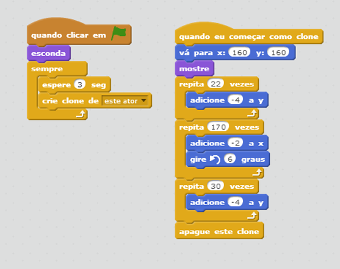
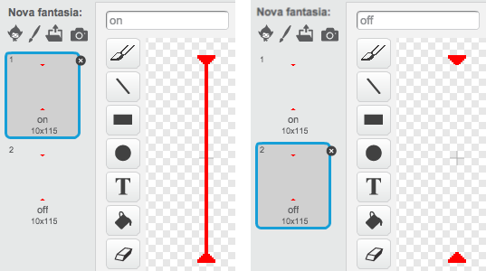

---
title: Dodgeball
level: Scratch 2
language: pt-BR
stylesheet: scratch
embeds: "*.png"
materials: ["Club Leader Resources/*","Project Resources/*"]
...

# Introdução { .intro }

Neste projeto você vai aprender como fazer um jogo de plataforma, em que você tem que evitar as esferas em movimento e chegar ao final do nível.

<div class="scratch-preview">
  <iframe allowtransparency="true" width="485" height="402" src="http://scratch.mit.edu/projects/embed/39740618/?autostart=false" frameborder="0"></iframe>
  
</div>

# Passo 1: Movimento do personagem { .activity }

Vamos começar criando um personagem que pode se mover esquerda e direita, bem como subir postes.

## Checklist do atividade { .check }

+ Inicie um novo projecto Scratch, e excluir o sprite gato para que seu projeto esteja vazio. Você pode encontrar o editor Scratch on-line em <a href="http://jumpto.cc/scratch-new">jumpto.cc/scratch-new</a>. 

+ Para este projeto, você deve ter uma pasta 'Project Resources'. Ele contém a imagem de fundo que você precisa. Certifique-se de que você pode encontrar esta pasta, e pergunte ao seu líder do clube, se você não consegue encontrá-la.

	

+ Adicione a imagem 'background.png' como fundo de área de atuação, ou desenhar o seu própria! Se você está desenhando seu próprio nível, certifique-se de que os postes e os pisos são de cores diferentes, e que há uma porta (ou algo similar) que o jogador tem que chegar. Veja como o seu projeto deve olhar:

	

+ Adicionar um novo sprite, que será o seu personagem. É melhor se você escolher um sprite com vários trajes, de modo que você pode fazer com que pareça que ele está andando.

	

+ Vamos usar as teclas de setas para mover o personagem. Quando o jogador pressiona a seta para a direita, você quer que seu personagem mire a direita, dar alguns passos e mude para a próxima traje:

	```blocks
		when flag clicked
		forever
			if <key [right arrow v] pressed? > then
				point in direction (90 v)
				move (3) Passos
				next costume
			end
		end
	```

+ Teste seu personagem clicando a bandeira e, em seguida, mantendo pressionada a tecla de seta direita. Será que o seu jogador se-mover para a direita? Será que o seu personagem parece como estão andando?

	

+ Para mover o seu personagem para a esquerda, você vai precisar adicionar outro bloco `if` {.blockcontrol} dentro de laço `forever` {.blockcontrol}, que move o seu personagem para a esquerda. Lembre-se de testar o seu novo código, para certificar-se de que ele funciona!

+ Para escalar um poste, seu personagem deve mover-se ligeiramente quando a seta para cima é pressionada e eles estão tocando a cor correta. Adicione este código dentro de laço de seu personagem `forever` {.blockcontrol}:

	```blocks
		if < <key [up arrow v] pressed?> and <touching color [#FFFF00]?> > then
			change y by (4)
		end
	```

+ Teste o seu personagem - você pode escalar os postes amarelos e chegar ao fim do seu nível?

	

## Salve o seu projeto { .save }

## Desafio: Completar o nível {.challenge}
Você pode adicionar mais código para o seu personagem, de modo que eles dizem alguma coisa 'se' `if` {.blockcontrol} se chegar à porta marrom?


## Salve o seu projeto { .save }

# Passo 2: Gravidade e saltando { .activity }

seu personagem pode se mover de forma mais realista se você adicionar a gravidade ea capacidade de saltar.

## Checklist do atividade { .check }

+ Você pode ter notado que o seu personagem pode andar fora de uma plataforma em pleno ar. Tente andar fora de uma plataforma e ver o que acontece.

	

+ Para corrigir isso, vamos adicionar a gravidade para o seu jogo. Crie uma nova variável chamada `gravity` {.blockdata}. Você pode esconder esta variável do seu estágio, se você quiser.

	

+ Adicione este novo bloco de código, que define a gravidade como um número negativo, e depois usa isso para mudar várias vezes la coordenada y de seu personagem coordenada y.

	```blocks
		when flag clicked
		set [gravity v] to [-4]
		forever
			change y by (gravity)
		end
	```

+ Clique na bandeira, e depois arraste o seu personagem para o topo do estágio. O que acontece? O gravidade faz como você esperava?

	

+ A gravidade não deve mover o seu personagem através de uma plataforma ou um poste! Agregue un bloco `if` {.blockcontrol}, de modo que a gravidade só funciona quando seu personagem está no ar. O código de gravidade deve olhar como este:

	```blocks
		when flag clicked
		set [gravity v] to [-4]
		forever
			if < not < <touching color [#0000FF]?> or <touching color [#FFFF00]?> > > then
				change y by (gravity)
			end
		end
	```

+ Teste a gravidade novamente. Será que o seu personagem para quando eles estão em uma plataforma ou um poste? Você pode andar fora da borda de plataformas para o nível inferior?

	

+  Vamos também fazer o seu personagem saltar quando o jogador pressiona a barra de espaço. Uma maneira muito fácil de fazer isso é mover seu personagem para arriba algumas vezes, usando este código:

	```blocks
		when [space v] key pressed
		repeat (10)
			change y by (4)
		end
	```

	Como a gravidade está constantemente empurrando seu personagem para baixo por 4 pixels, você precisa escolher um número superior a 4 em su bloco `change y by (4)` {.blockmotion}. Alterar esse número até que você esteja contento como seu personagem salta.

+ Se você testar este código, você vai notar que ele funciona, mas o movimento não é muito bom. Para fazer o salto mais suave, você precisará mover o seu personagem em quantidades cada vez menores, até que não está saltando mais.

+ Para fazer isso, criar uma outra variável chamada `jump height` {.blockdata}. De novo, você pode esconder esta variável se você preferir.

+ Apagar o código de salto que você adicionou ao seu caráter, e substituí-lo com este código:

	```blocks
		when [space v] key pressed
		set [jump height v] to [8]
		repeat until < (jump height) = [0] >
			change y by (jump height)
			change [jump height v] by (-0.5)
		end
	```

	Este código move o seu personagem por 8 pixels, em seguida, 7,5 pixels, em seguida, 7 pixels e assim por diante, até que seu personagem tenha terminado de saltar. Isso faz o salto olhar muito mais suave.

+ Alterar o valor inicial de sua variável `jump height` {.blockdata} e testá-lo até que você esteja feliz com o salto de seu personagem.

## Salve o seu projeto { .save }

## Desafio: Improved jumping {.challenge}
Seu personagem é capaz de saltar quando a barra de espaço é pressionada, mesmo se eles já estão no ar. Você pode testar isso mantendo pressionada a barra de espaço. Você pode corrigir isso, para que a sua personagem só pode saltar se eles estão tocando uma plataforma azul? (`if` {.blockcontrol})

## Salve o seu projeto { .save }

# Passo 3: Esquivando esferas { .activity .new-page}

Agora que você tem o seu personagem movendo ao redor, vamos adicionar algumas esferas. Para que o seu personagem pode evitá-las

## Checklist do atividade { .check }

+ Crie um novo sprite da esfera. Você pode escolher qualquer tipo de esfera que você preferir.

	

+ Redimensione a sua esfera, de modo que seu personagem pode saltar sobre ela. Tente saltar na frente da esfera para testá. 

	

+ Adicione este código ao seu esfera:

	

	Esse código cria uma nova esfera cada 3 segundos. Cada nova esfera se move ao longo da plataforma superior.

+ Clique na bandeira para testar isso.

	

+ Adicionar mais código para seu sprite, de modo que elas se movem em todas as 3 plataformas.

	

+ Finalmente, você precisará de código para quando seu personagem é atingido por uma bola! Adicione este código ao seu sprite:

	```blocks
		when I start as a clone
		forever
			if < touching [Pico walking v]? > then
				broadcast [hit v]
			end
		end
	```

+ Você também vai precisar adicionar código para o seu personagem. de modo que o personagem vai voltar para o início:

	```blocks
		when I receive [hit v]
		point in direction (90 v)
		go to x: (-210) y: (-120)
	```	

+ Teste o seu personagem e ver se eles vão voltar para o início, quando eles foram atingidos por uma esfera.

## Salve o seu projeto { .save }

## Desafio: Esferas aleatórias {.challenge}
As esferas que seu personagem tem que evitar todass têm a mesma aparência, e sempre aparecem a cada 3 segundos. Você pode melhorá-las? De modo a que as esferas:

+ Nem todas têm a mesma aparência?
+ aparecem depois de um período de tempo aleatório?
+ são tamanho aleatório?


## Salve o seu projeto { .save }

# Passo 4: Lasers! { .activity .new-page}

Vamos fazer o seu jogo um pouco mais difícil para concluir, através da adição de lasers!

## Checklist do atividade { .check }

+ Adicionar um novo sprite para o seu jogo, chamado 'Laser'. Ele deve ter 2 trajes, chamados 'on' e 'off'.

	

+ Coloque o novo laser em qualquer lugar que você gosta, entre 2 plataformas.

	

+ Adicione código para o seu laser, para alternar-lo entre os 2 trajes.

	```blocks
		when flag clicked
		forever
			switch costume to [on v]
			wait (2) secs
			switch costume to [off v]
			wait (2) secs
		end
	```

	Se preferir, você pode esperar (`wait` {.blockcontrol}) um período de tempo aleatório (`random` {.blockoperators}) entre mudanças.

+ Finalmente, adicione código para o seu raio laser, de modo que a mensagem 'hit' é transmitido quando o laser atinge o seu personagem. Este código será o mesmo que o código que você adicionou ao seu esfera.

	Você não precisa adicionar mais código para o seu personagem - eles já sabem o que fazer quando são atingidos!

+ Testar o seu jogo para ver se você pode passar o laser. Mude `wait` {.blockcontrol} em seu código se os lasers são muito fácil ou muito difícil.

## Desafio: Mais obstáculos {.challenge}
Se você acha que seu jogo ainda é muito fácil, você pode adicionar mais obstáculos ao seu nível. Você pode adicionar qualquer coisa que você quiser, mas aqui estão algumas idéias:

+ A borboleta assassina;
+ Plataformas que aparecem e desaparecem;
+ Bolas de tênis que devem ser evitadas.


Você pode até mesmo criar mais de um pano de fundo, e passar para o nível seguinte quando seu personagem atinge o porta marrom:

```blocks
	if <touching color [#714300]?> then
		switch backdrop to [next backdrop v]
		go to x: (-210) y: (-120)
		wait (1) secs
	end
```

## Salve o seu projeto { .save }

## Desafio: Gravidade melhorada {.challenge}
Há outro pequeno erro no seu jogo: a gravidade não puxa para baixo o seu personagem se alguna parte dela está tocando uma plataforma azul - mesmo que é cabeça! Você pode testar isso escalando a maior parte do caminho até um poste e, em seguida, movendo-se para a esquerda.


Você pode corrigir este erro? Para fazer isso, você precisa dar ao seu personagem diferentes calças (on _all_ costumes)...


...e substitua o código: 

```blocks
	< touching color [#0000FF]? >
```

con:

```blocks
	< color [#00FF00] is touching [#0000FF]? >
```

Lembre-se de testar suas melhorias para se certificar de que você tenha corrigido o erro!

## Salve o seu projeto { .save }

## Desafio: Mais vidas {.challenge}
Você pode dar ao seu personagem 3 vidas (`lives` {.blockdata})? em vez de enviá-los de volta para o início de cada vez? Veja como o seu jogo poderia trabalhar:

+ Seu jogador começa com 3 vidas;
+ Sempre que o jogador é atingido, uma vida é perdida e eles vão voltar para o início;
+ Se não houver vidas, o jogo termina.

## Salve o seu projeto { .save }
